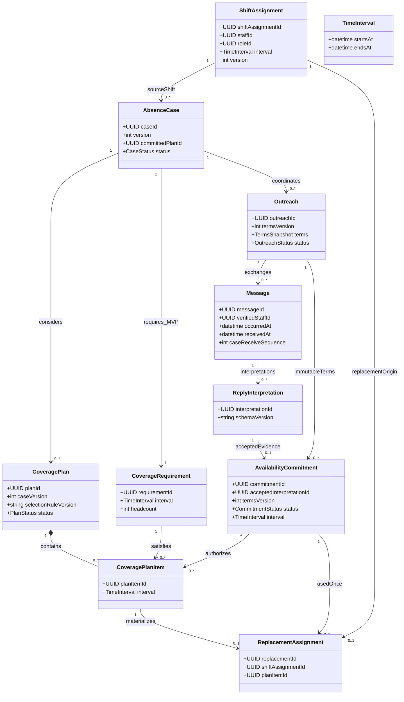
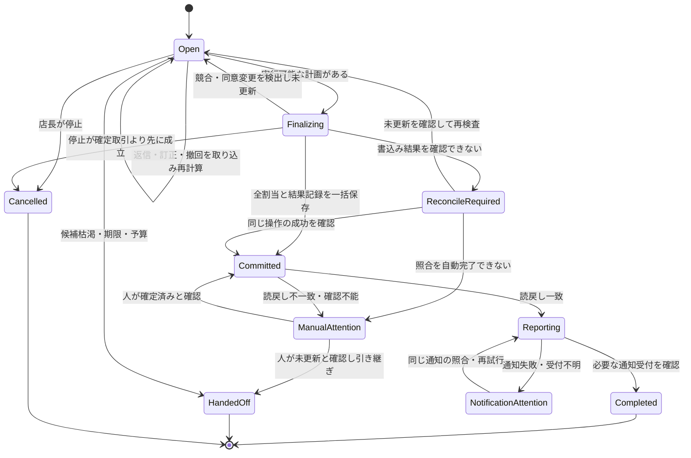
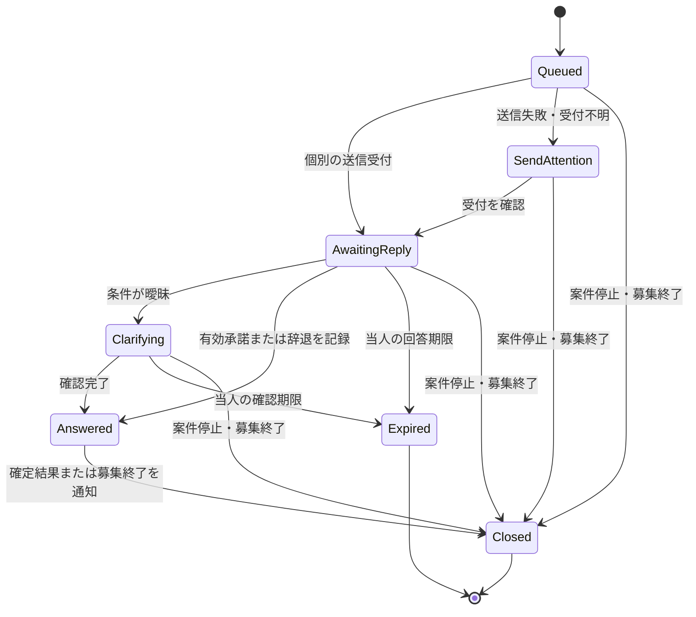

# 案05 データモデル v0.2 設計レビュー

レビュー日：2026-09-20  
対象：ユーザー提供 `proposal-05-data-model-v0.2.md`（690行、23クラス）  
対象範囲：概念・論理モデル、UMLの関連・多重度・状態、業務不変条件。DDLや製品選定は対象外。

## 判定

**返信・承諾・計画・確定を分けた構造は維持したい。ただし、代表ケースの矛盾と、並行処理・変更・確定の境界が残っており、そのまま物理設計へ固定する段階ではない。**

この版は「全員へ個別同時打診」「明確な自然文返信を承諾に使う」「月次上限を検査する」という方針へ進んでいる。過去の提案にあった順次打診・必ず確認ボタンを挟む方式との差は、単独では不具合としない。v0.2の方針を前提に、成立に必要な条件を確認した。文書内の暫定方針を、ユーザーが新たに承認した実装指示とは扱っていない。

### 維持したい設計

- 元の勤務予定、欠勤の必要枠、代替勤務を概念上分ける。
- 原文・解釈・検査・承諾・選定結果・確定結果を追跡可能にする。
- 半開区間を使い、本人の承諾した時間を勝手に切り詰めない。
- 冪等性、確定前の再検査、読戻し、訂正・撤回を明示する。
- 月次上限をデモの設定と位置付け、法令適合を保証していない。

P1は誤確定・制約違反・処理の取りこぼしにつながるため実装前に修正、P2は論理モデルを確定する前に定義する事項。行番号はレビュー対象版に対応する。

## 指摘一覧

| ID | 優先度 | 対象 | 要点 |
|---|---|---|---|
| R01 | P1 | §7.7、§9.1、§11／524〜533、561、630〜635行 | 代表ケースが過剰配置禁止と矛盾する |
| R02 | P1 | §8／543〜549行 | 曖昧な変更を受けた旧承諾が確定に使えてしまう |
| R03 | P1 | §5、§7.8、§9.5／161〜169、261〜273、537〜539、594〜599行 | 確定する計画・版・取引境界が足りず、冪等キーだけでは競合を防げない |
| R04 | P1 | §6／357〜376行 | 同時打診なのに一人への確認が案件全体の状態を占有する |
| R05 | P1 | §3.2、§6、§10／54、378〜388、611行 | 確定事実・確認失敗・通知・終端が混在する |
| R06 | P1 | §5、§7.3、§9.2／181〜208、444〜445、565〜566行 | 空き時間が分断されても開始終了1組でしか表せない |
| R07 | P1 | §9.3／573〜585行 | 一部欠勤の月次集計と勤務データの正本が未定義 |
| R08 | P2 | §5、§7.4〜7.6／210〜240、489〜518行 | 承諾の条件版・採用解釈・本人・訂正順を追う情報が不足 |
| R09 | P2 | §7.2、§10／431〜433、603〜611行 | 計画上の不足と確定上の不足が同じ名前になっている |
| R10 | P2 | §5、§13／321〜344、674〜684行 | 多重度、関連、計算値の位置付けを明文化したい |

## R01：代表ケースは現在のルールでは確定できない

§11はA＝19〜21時、B＝18〜20時、C＝19〜22時の承諾からB・Cを選ぶ。しかし§9.1は必要人数を超える割当を禁止している。

| 区間 | B | C | 配置人数 | 必要人数 |
|---|---|---|---:|---:|
| 18〜19時 | 勤務 | — | 1 | 1 |
| 19〜20時 | 勤務 | 勤務 | **2** | **1** |
| 20〜21時 | — | 勤務 | 1 | 1 |
| 21〜22時 | — | 勤務 | 1 | 1 |

この3人の部分集合を全列挙しても、承諾時間を変えずに全区間ちょうど1人になる組合せはない。B・Cは「Aも含めるより短い」だけで、合法な計画ではない。

**修正方針：実行可能性の検査を先に、順位付けを後にする。** 各区間で人数が必要人数と一致し、承諾条件と割当が一致する組合せだけを選定対象にする。現在の例は「追加確認が必要な不成立例」として残し、Bが18〜19時へ新たに同意した場合にB・Cで成立する例を併記するとよい。

必要人数1、必要区間内、重複なし、承諾どおりの割当なら、全時間を埋める計画の勤務時間合計は必ず必要時間と等しい。この条件では第1優先の「勤務時間合計が短い」は同率になり、実質的にスタッフ数等で選ぶ。残してもよいが、MVPで最適化に効く項目として説明しない。

「過剰配置を許して合計時間を最小化する」を選ぶなら別の成立条件であり、§9.1と予算・画面の説明を変更する必要がある。

## R02：変更確認中の承諾は履歴を残しつつ確定対象から外す

§8の「曖昧な変更では現在の承諾を直ちに無効化しない」は、履歴を消さない方針としてはよい。しかし、確定に使える状態のままだと危険になる。

例：Bが19〜22時に承諾した後、「やはり21時までかもしれません」と返信。その確認中にCの18〜19時の承諾が届くと、旧Bの19〜22時を使って確定できてしまう。

**修正案：** `suspended_pending_clarification` を設ける。旧承諾の内容は上書きせず保持するが、計画・確定には使わない。確認後は、旧条件を本人が明確に再承諾した記録、または新条件の承諾を作る。タイムアウトで旧条件を自動復活させない。

返信の自然文解釈が非同期なら、変更らしいメッセージを受信してから解釈が終わるまでにも競合がある。MVPでは、選定スタッフから届いた未処理の新しい返信がある間はそのスタッフの確定を保留する、と決めると扱いやすい。

訂正・撤回が「確定前」かは、モデル処理が終わった時刻ではなく、サーバーへの永続受信と確定取引のどちらが先に成立したかで決める。受信と確定が同じ案件の排他規則を使い、受信済みの変更を未処理のまま無視して確定しない。

## R03：計画単位の一括確定と、最新状態を守る境界を追加する

`ReplacementAssignment.idempotencyKey`と`sourceScheduleVersion`だけでは、次の問題が残る。

- B・CのうちBだけ保存されて障害が起きると、全枠確定の方針を守れない。
- 同時返信を別処理が受け、別の冪等キーで別計画を確定すると、同一案件で複数の計画が通り得る。
- 元シフトの版が同じでも、候補スタッフの別勤務、月次上限、承諾状態は変更され得る。
- `sourceScheduleVersion`が指すScheduleが図にない。元の勤務1件のversionなら、その意味を名称でも明示する必要がある。
- 同じ承諾が複数の計画候補に含まれるため、代替勤務のcommitmentIdだけでは、採用した計画版が一意に分からない。

**追加したい論理上の情報：**

| 対象 | 情報・関連 |
|---|---|
| AbsenceCase | caseVersion、実行委任・停止状態、committedPlanId（最大1件） |
| CoveragePlan | caseVersion、選定規則版、参照した勤務・ルールの版、選択した承諾の版 |
| CoveragePlanItem | 必要枠と、条件を固定した承諾への参照 |
| ReplacementAssignment | 採用PlanItemへの参照。最終勤務のIDとの関係 |
| 確定操作記録 | 操作キー、依頼内容のhash、対象plan、確定済み／未実行／照合必要、結果参照 |

確定前検査と全割当・採用plan・案件状態・操作結果・通知待ち記録の保存を、一つの取引で行うという契約を明記する。DB製品の選定は今しなくてよい。

MVPは1店舗なので、全ての勤務・上限・承諾変更を同じ店舗／案件の排他規則へ通す簡単な方式も選べる。将来、スタッフ・月単位へ細かくする余地がある。どちらでも「再読込した後、書込みまでに別処理が条件を変える」隙間を残さない。

**集約の責任案：** 案件が「採用する計画は一つ」を守り、勤務表が「スタッフの重複と月次上限」を守る。計画を独立に更新できるだけの設計にはしない。

## R04：案件全体と、相手ごとの対話状態を分ける

同時打診では「Aは追加確認中、Bは有効承諾、Cは返信待ち」が同時に成立する。現図の `返信検査中 → 追加確認中` は、これを案件全体の唯一の状態にしてしまう。

その結果、Aが曖昧なだけで案件全体が引き継ぎになったり、B・Cだけで全時間が埋まっているのにAの確認を待ち続けたりする解釈が生まれる。

**修正案：**

- `AbsenceCase` は調整中・確定処理中・確定済み・要対応・完了等の業務状態を持つ。
- `Outreach` は相手ごとの送信待ち・返信待ち・追加確認中・回答済み・失効等を持つ。
- `AgentRun` は各イベントを処理した実行の状態を持つ。
- 一人の確認不成立は、その人の承諾を使えない理由にする。案件全体を終えるかは、残る候補・期限から別に判定する。

同時送信の一部失敗も相手ごとの状態が必要。例えばAへ送信済みでBが失敗した場合、案件を `技術エラー → 終端` にしてAの返信を取りこぼさない。送信済み・未送信・受付不明を記録して継続／終了を決める。

全時間が確定した後は、未採用スタッフへの「募集終了・今回は確定していない」通知と、以後の返信を確定へ使わない制御が必要。初回打診と同じMessage構造を流用でき、通知ごとに新しいクラスを増やす必要はない。

## R05：確定事実は、読戻し・通知・後日の変更申告と分ける

§3.2は「反映・読戻しできた状態」を確定した代替勤務とするが、DB更新が成立した直後に読戻しが失敗しても、勤務は既に確定している可能性がある。「確認できていない」ことを「未確定」にしてはいけない。

現在の `シフト更新中 → 技術エラー → [*]` では、その違いと、結果照合後の復旧先が読めない。また§3.2で約束した確定通知が、§10の業務完了条件に入っていない。

**分けるべき情報：**

| 情報 | 値の例 |
|---|---|
| 書込みの事実 | 未実行／確定済み／結果の照合が必要 |
| 確認の状態 | 未確認／一致／不一致 |
| 通知の状態 | 待ち／受付済み／失敗／受付不明 |
| 業務上の対応 | 自動調整中／完了／未確定で引き継ぎ／確定後に要対応 |

全てを独立したテーブルやenumにする必要はないが、同じ「技術エラー」に潰さない。アプリ内の模擬通知受付と、本人が閲覧した事実も別にする。

さらに `完了 → [*]` と `完了 → 引き継ぎ` は、何を終える図なのかを曖昧にする。Mermaidの `[*]` は遷移方向によって開始・終了を表す。構文が描けることと、完了後イベントの扱いが明確なことは別である。[公式の状態図記法](https://mermaid.js.org/syntax/stateDiagram.html#start-and-end)

選択肢は、完了を保持したまま別の変更申告を作るか、案件自体を要対応へ移して元のcompletedAt・確定記録を残すか。後者なら完了直後に終端へ進めず、修正が閉じるまで扱える状態にする。既存本文の「完了済み案件を自動再開しない」に合わせるなら、前者が自然。

## R06：勤務可能時間は単一区間とは限らない

`CandidateEvaluation.feasibleStartsAt/feasibleEndsAt`と`Outreach.offeredStartsAt/offeredEndsAt`は、時間帯を1組だけ持つ。一方、§9.2は既存勤務の重複を除いて残りを候補にする。

例えば、可能時間18〜22時から既存勤務19〜20時を除くと、`[18,19)` と `[20,22)` の2区間になる。18〜22時として保存すれば勤務重複を含み、1区間だけ保存すれば補填可能時間を欠落させる。

**修正案：** `TimeInterval` を値オブジェクトにし、候補評価と提示条件に区間集合を持たせる。1人が複数区間を一度に承諾する機能までMVPへ増やす必要はなく、承諾は一つの連続区間だけに制限してもよい。

より小さくするなら、MVPでは「各候補の補填可能時間は一つの連続区間になるfixtureだけを扱い、分断時は範囲外」と明記する。現在の一般的な差集合計算を残したまま、データだけ単一区間にするのは避ける。

## R07：月次上限には、一部欠勤と正本の定義が必要

§9.3の「欠勤・取消済みの勤務は含めない」では、一部欠勤の集計が決まらない。元勤務18〜22時のうち20〜22時だけ欠勤なら、残る18〜20時の120分は予定時間として数える必要がある。

また、`ShiftAssignment` と `ReplacementAssignment` を別に保持する場合、代替勤務を通常のシフト表にも追加するのかが未定義。両方に書いて双方を加算すると二重計上し、片方だけを見る重複検査なら勤務を見逃す。

**推奨案：概念は分けたまま、勤務の正本を一つにする。**

- `ShiftAssignment` を「元からある勤務」だけでなく全勤務の正本へ一般化する。
- `ReplacementAssignment` は、どの欠勤・計画・承諾から作った勤務かを示す関連情報として、正本のshiftAssignmentIdを参照する。
- 月次集計と重複検査は正本に対して行い、代替関連情報を再度加算しない。
- 元勤務の一部欠勤は、元区間から欠勤区間を除いた実効予定区間として数える。重複する欠勤区間は和集合で除き、二重に減算しない。

別々の勤務クラスを正本として残す案も可能だが、その場合は両方を必ず統合する単一の勤務照会・更新境界が必要。どちらか一方を選ぶ。

月の境界はStore.timezoneで決め、月に重なる部分だけを集計する。月跨ぎをMVPで拒否してもよい。上限データなし、残り時間が負、上限変更の扱いも定義する。`StaffWorkLimit` のstaff・対象月は現在有効な設定が一意になることを示す。

欠勤者本人は代替候補から明示的に除外する。欠勤分を勤務時間から除くことで、本人が空いている候補として再登場する実装を防ぐ。

## R08：承諾の証拠と変更順を追える関連を足す

本文は「採用した解釈」「本人」「より新しい訂正・撤回」「選定規則の版」を必要としているが、その参照がクラス図では不足している。

| 情報 | 追加・明確化する場所 | 必要な理由 |
|---|---|---|
| 採用した解釈ID | Commitment.acceptedInterpretationId | 同じMessageに複数解釈があるためsourceMessageIdだけでは不足 |
| 提示条件の版と固定内容 | OutreachのtermsVersion／snapshot、Commitmentから参照 | 日付・役割・最大時間・期限が後で変わっても当時の条件を再現 |
| 認証した送信者 | Messageの検証済みstaff参照とchannelの根拠 | outreach宛先と実際の回答者が一致することを検査 |
| 発生・受信・案件内順序 | Message.occurredAt、receivedAt、受信順序 | 外部時刻やAI完了順だけで最新と決めない |
| 訂正対象 | Message／Commitmentのsupersedes参照 | 新しい返信がどの承諾を変更したか追跡 |
| 有効期限・保留・失効理由 | Commitmentまたは不変なOutreach条件から導出 | 期限内に届いた返信でも、案件終了後に確定しない |
| 選定規則版 | CoveragePlan.selectionRuleVersion | 本文で要求している再現性を持たせる |

全てを重複保存する必要はない。条件が不変な親へ辿れるなら参照でよい。逆に、更新される親の「現在値」を過去の承諾条件として使わない。

自然文承諾という方針を維持するなら、打診の「勤務可能時間の申告」という表現を「明確に回答した条件で、選定された場合は勤務を確定してよいという承諾」と揃える。日付・店舗・役割も提示する。申告にすぎないと説明した回答を、自動確定の許可へ読み替えない。

コードによる時刻・schema検査は、モデルが条件を読み落としていないことを保証しない。原文の根拠箇所と省略時刻の補完規則を記録し、限定した文型以外・未解決の条件がある場合は追加確認へ進める。すべてに確認ボタンを要求する変更は、このレビューの前提にはしない。

## R09：「未充足」を二つに分け、途中状態を誤表示しない

現文書の未充足は「確定した代替勤務」を差し引くため、一括確定前は常に18〜22時の全枠が未充足になる。これは確定ベースの指標として正しいが、部分承諾後に計画上の残枠を扱う情報とは異なる。

| 名称案 | 算出元 | 用途 |
|---|---|---|
| confirmedUncoveredIntervals | 必要枠−確定勤務 | 業務としてまだ確保できていない時間 |
| planUncoveredIntervals | 必要枠−指定した候補計画の区間 | その計画を完成させるために不足する時間 |

有効な承諾をすべて足し合わせた和集合は、実行可能な計画とは限らない。R01のB・Cも和集合なら全時間を覆うので、承諾集合から「不足0」と表示して確定可能と誤認させない。

`CoverageRequirement.status=partially_filled` は、確定済み勤務の状態なら一括確定のMVPでは通常発生しない。候補計画の途中状態に使うなら別名にする。`fullyCoversRequirement` も単なる区間和集合の充足と、全制約を満たす実行可能性を区別する。

## R10：UMLの多重度・関連と、保存しない計算値を整理する

| 現在の表現 | レビュー・提案 |
|---|---|
| AbsenceCase→CoverageRequirementが1..* | 将来拡張なら妥当。MVPは1と制約を付け、PlanItemから必要枠への参照を追加。複数枠対応済みとはしない |
| CoveragePlan→PlanItemが1..* | 承諾0件の評価も計画として保存するなら0..*。1件以上あるときだけ計画を作る契約なら現状でよい |
| Commitment→Replacementが0..1 | 承諾1件＝連続した割当1件なら妥当。複数区間承諾を導入する際に再検討 |
| AbsenceCase→Handoffが0..1 | 1件の引き継ぎレコードへ追記するなら妥当。確定後の複数訂正を個別記録するなら0..*または子イベント |
| Store→ShiftAssignment関連がありstoreId属性は省略 | 概念図なら属性と関連を二重記載する義務はない。不備ではなく、論理設計時に店舗の所有関係を固定する事項 |
| CommitmentのCase・Staff・Message関連線がない | 属性で辿れるが、主要な証拠経路は線でも示すとレビューしやすい。特に採用解釈との対応を一致させる |
| Replacement→PlanItemがない | R03の確定根拠に必要。追加を推奨 |
| 候補評価に除外理由が1つ | 最初の除外理由だけを示す仕様なら可。全不合格理由を説明するなら理由集合を使う |
| coveredMinutes等が通常属性 | `/coveredMinutes`等の表記または注記で導出値と分かるようにし、保存値を更新可否の正本にしない |
| ActionLog／ConstraintCheckに時刻等が省略 | 主要エンティティ表との整合を取り、実行順・検査時刻・規則版・結果の参照先を定義 |

Mermaidは多重度、関連、属性等の表記を提供している。ただし、線を増やしただけでは「同じ案件・スタッフ・条件でなければならない」という業務制約は表現しきれないので、注記と不変条件を併記する。[公式のクラス図記法](https://mermaid.js.org/syntax/classDiagram.html)

23クラスを23テーブルへそのまま変換する必要はない。CandidateEvaluationは計算結果、TimeIntervalは値、CoveragePlanは不変の計画スナップショット、ActionLog等は実行記録として分類してから物理化する。クラス図にメソッドが少ないこと自体は、データモデルを目的とする本書の問題ではない。

## 修正クラス図案：重要な証拠経路と勤務の正本

以下は全クラスの置換ではなく、R03・R07・R08に対応する関連の抜粋。図のために示した型は概念上のもの。既存のRole、Availability、権限、実行記録等は省略している。

重要な注記：採用planは案件あたり最大1つ。PlanItemと承諾の日時・役割・スタッフ・案件を一致させる。Replacementと正本Shiftの条件も一致させる。採用されなかったPlanItemからReplacementを作らない。CompositionはPlanItemの計画への所属を示し、履歴を物理削除する指示ではない。

## 修正状態図案：案件と相手別の対話を分離

案件図では、正常に確定した結果、照合待ち、通知待ちを分ける。確定後の変更申告は、完了した自動調整を再実行せず別のHandoffへ記録する案を採る。

`ManualAttention` は成否未確定・確認未了を抱えるため、そのまま未確定案件の終端にしない。別プロセスが復旧する場合でも、確定したか不明という情報を保持する。図は主要経路で、各処理の再試行・期限検査は別のイベント規則にまとめる。

この対話図のAnsweredは初回返信処理済みを表す。以後の訂正・撤回は、Outreachを再募集へ戻さずMessageイベントとして受け、Commitmentの保留・失効・差替えへ反映する。案件終了後の返信も記録・適切な回答は可能だが、新しい勤務確定には使わない。

## v0.3で明文化したい不変条件

1. 欠勤区間は元勤務の内部で、同じ店舗・職種の必要枠を生成する。
2. 欠勤者本人へ代替打診しない。同じ欠勤区間の重複した稼働案件を作らない。
3. 打診の宛先と検証済み回答者が一致する。
4. 確定に使う承諾は有効・期限内で、訂正確認中でも未処理の変更ありでもない。
5. PlanItemと承諾は同一の時間・役割・スタッフ・条件版を指す。
6. 必要枠を分割した各区間で配置人数が必要人数と一致し、必要枠外の勤務を含まない。
7. 1案件で確定する計画は一つ。全割当は全件成功または全件未反映。
8. 同じ承諾を重複して勤務に使わない。
9. 月次集計は正本の勤務を一度だけ数え、欠勤区間・取消を正しく除く。
10. 停止・承諾変更・勤務変更・確定が同じ排他規則を守る。
11. 同じ操作キーで内容が異なる依頼は拒否。同じ内容なら以前の結果を照合する。
12. 確定済み・通知失敗を未確定に戻さない。未採用者にも募集終了を知らせる。

## 確認用の反例と期待結果

| ID | 入力・競合 | 期待結果 |
|---|---|---|
| V01 | 原文のA19〜21、B18〜20、C19〜22 | 完全な合法計画なし。B・Cをそのまま確定しない |
| V02 | Bが新条件18〜19へ再承諾、C19〜22 | 2割当で成立 |
| V03 | B承諾後「21時までかも」、その後Cの返信 | Bを保留し旧22時終了で確定しない |
| V04 | Bの訂正は受信済み、AI解釈が遅い | 確定前検査が未処理変更を検知 |
| V05 | A確認中にB・Cの条件が揃う | Aだけを待たず合法な計画で進める |
| V06 | A送信済み、B送信失敗 | 相手別結果を保持し、Aの返信を取りこぼさない |
| V07 | 候補が18〜22可能、19〜20は既存勤務 | 18〜19と20〜22の2区間、または明示的なMVP範囲外 |
| V08 | 元勤務18〜22、一部欠勤20〜22 | 月次予定に18〜20の120分を残す |
| V09 | 同じ候補の月次残り120分に別処理が勤務追加 | 確定取引で最新状態を検査し上限を超えない |
| V10 | 別操作キーで同一案件の2計画を同時確定 | 一方だけ成立。冪等キーが異なっても二重計画を防ぐ |
| V11 | 2割当のうち片方の保存が失敗 | 片方だけの確定を残さない |
| V12 | 保存後に応答喪失／読戻し失敗 | 操作結果を照合。勤務を再作成しない |
| V13 | 確定通知失敗、未採用者から遅れて承諾 | 既存確定は維持し、新たな割当を作らない |
| V14 | 同じMessageを再解釈、旧解釈の結果が遅延 | 採用解釈を特定し、古い解釈で承諾を増やさない |
| V15 | 完了後に同じスタッフが複数回訂正 | 自動再確定せず、変更申告の履歴を保持 |

V01の区間被覆は小さな列挙計算で確認した。その他は設計に対する受入試験案で、アプリ実装で実行済みではない。図の描画・Mermaidパーサーによる検証は未実施であり、ここでは記法資料と関連・状態の意味を確認した。

## 4日間に収めるための修正順

1. R01の実行可能条件を確定し、テスト例の期待値を直す。
2. R02/R03/R05の「いつ確定してよいか・何が確定したか」を固定する。
3. R04の案件と対話の状態を分ける。
4. R06/R07を、区間集合と単一の勤務正本で解決するか、MVP制限で縮小するか選ぶ。
5. R08〜R10の参照・多重度・計算値を揃え、初めて物理設計へ進む。

推論回数・金額予算・呼出し結果・未完了処理の再開は、別の実行モデルで補う必要がある。全員同時打診では返信ごとの並列推論が予算を超えないよう、呼出し前の予約・回数更新も共通に管理する。今回の図に全ての基盤クラスを押し込む必要はないが、AgentRunに上限値を置くだけで実行制御まで完成とはしない。

採用する場合は、既存の[ADR一覧](../README.md)に「同時個別打診」「自然文承諾の成立条件」「勤務時間の正本」「過剰配置禁止と計画の選定」を変更判断として残す。以前の設計へ黙って上書きしない。

対象原文と既存RFC・ADRは変更していない。図と修正案はレビューの提案であり、採用済み設計や実装結果ではない。
