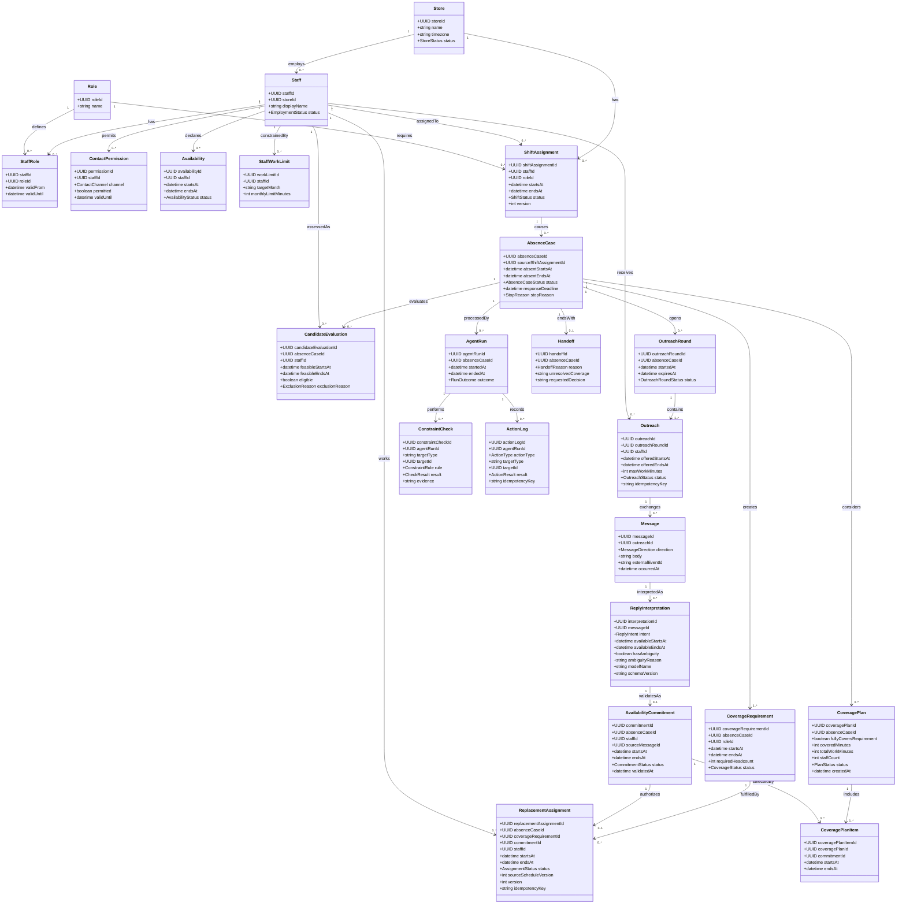
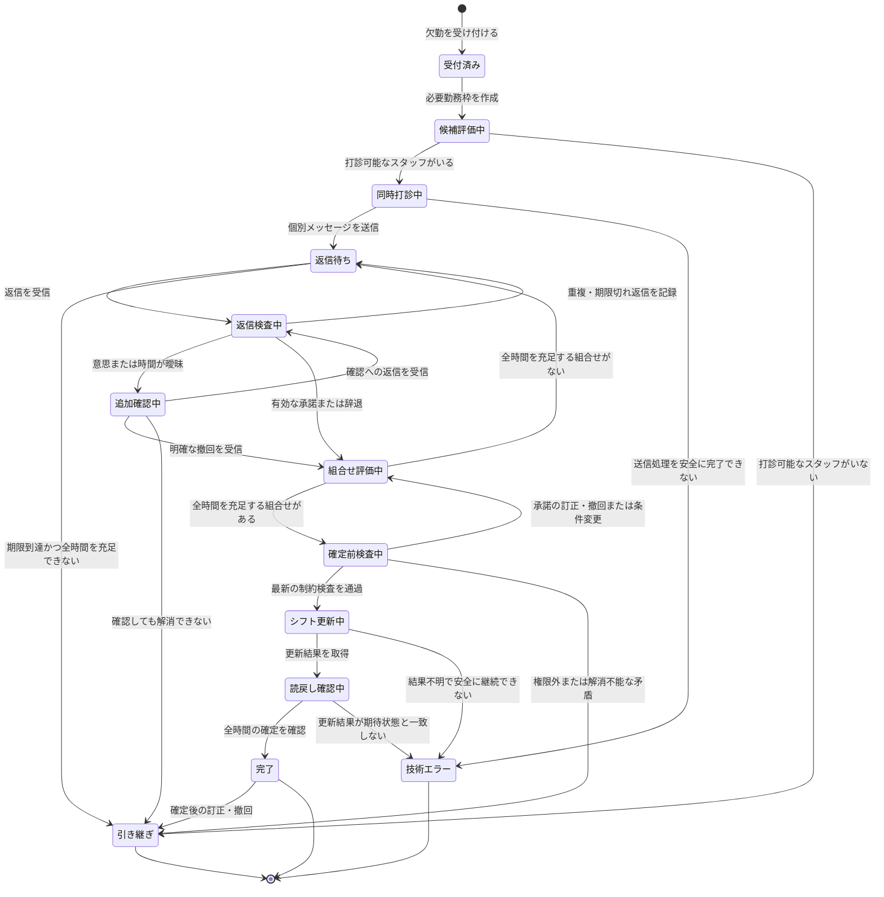

# 案05：突発欠勤対応エージェントのデータモデル

作成日：2026年9月20日  
版：0.2  
位置づけ：MVP実装に向けた概念・論理データモデル

## 1. この版で反映した内容

版0.1を土台に、次の暫定方針を反映した。

1. 条件を満たすスタッフ全員へ、個別メッセージを同時に送る。
2. 元の打診と返信から勤務意思・勤務時間が一意に決まり、各種検査を通過した返信を、確定に使える承諾とする。
3. シフト確定前の訂正・撤回は自動で再計画し、確定後の訂正・撤回は店長へ引き継ぐ。
4. 返信順に一人ずつ確定せず、現在までの承諾で欠員時間をすべて埋められる組み合わせが見つかった時点で、不要な勤務を含まない組み合わせを確定する。
5. MVPでは、既存勤務との重複と、店舗が設定した月次就労時間上限を検査する。

状態遷移図とクラス図をUML記法で追加した。人件費を考慮した選択や、より詳細な労務制約は、将来の検討事項として記録している。

## 2. モデリングの目的と範囲

このデータモデルは、飲食店で突発欠勤が発生したときに、AIエージェントが次の処理を安全に進めるための情報を整理する。

1. 欠勤によって不足する役割と時間を特定する。
2. 勤務条件を満たすスタッフを抽出する。
3. 該当するスタッフ全員へ個別に同時打診する。
4. 自然文の返信から勤務意思と勤務可能時間を抽出する。
5. 部分承諾、辞退、訂正、撤回を受けて不足時間を再計算する。
6. 欠員時間を埋める承諾の組み合わせを選ぶ。
7. 最新の勤務条件を再検査して代替勤務を確定する。
8. 完了できない場合は、理由と経過を店長へ引き継ぐ。

対象は、架空の1店舗、1件ずつ処理する突発欠勤、テスト用メッセージ環境、テスト用シフト表である。複数店舗、本番の連絡サービス、給与計算、需要予測、食材発注は扱わない。

## 3. モデルの基本方針

### 3.1 元シフト、必要勤務枠、代替勤務を分ける

欠勤した人の元シフトを直接別の人へ付け替えるだけでは、複数人による部分的な補填を表現しにくい。そのため、次を別の情報として管理する。

- **元の勤務予定**：誰が、いつ、どの役割で働く予定だったか
- **欠勤案件**：どの欠勤を調整しているか
- **必要勤務枠**：どの時間帯・役割を埋める必要があるか
- **代替勤務**：誰が、どの時間帯を代わりに担当すると確定したか

例えば18〜22時の欠勤に対して、Bが19〜22時、Cが18〜19時を担当する場合、必要勤務枠は1件、代替勤務は2件になる。

### 3.2 返信、承諾、選定、確定を分ける

次の4段階を別の情報として管理する。

1. **返信**：スタッフから届いた原文
2. **有効な承諾**：勤務意思と時間を一意に特定でき、返信に関する検査を通過した状態
3. **選定結果**：有効な承諾の中から、必要時間を埋める組み合わせとして選ばれた状態
4. **確定した代替勤務**：最新の勤務条件を再検査し、シフトへ反映・読戻しできた状態

有効な承諾は、勤務の確定を意味しない。スタッフへの打診時には、回答後に確定結果を改めて連絡することを明示する。

### 3.3 AIの解釈と業務上の確定情報を分ける

スタッフから届いた原文、AIが抽出した内容、コードによる検査結果、シフトの確定結果を分けて保存する。AIの解釈結果だけでシフトが確定したことにはしない。

### 3.4 現在状態と履歴を両方残す

画面表示や処理には現在状態を使い、監査・重複防止・障害復旧にはイベントと操作履歴を使う。モデルの内部思考は保存せず、入力、選択した行動、適用した条件、検査結果を記録する。

### 3.5 時間帯は半開区間として扱う

勤務時間は `[開始日時, 終了日時)` として扱う。18:00〜19:00と19:00〜22:00は重複せず、連続した時間帯になる。

## 4. 主要エンティティ

| エンティティ | 役割 | 主な情報 |
|---|---|---|
| `Store` | 対象店舗 | 店舗ID、名称、タイムゾーン、状態 |
| `Staff` | スタッフ本人 | スタッフID、表示名、在籍状態 |
| `Role` | 勤務上必要な役割 | 役割ID、名称 |
| `StaffRole` | スタッフが担当できる役割 | スタッフID、役割ID、有効期間 |
| `ContactPermission` | AIがスタッフへ連絡できる範囲 | スタッフID、連絡可否、連絡手段、有効期間 |
| `Availability` | 事前登録された勤務可能時間 | スタッフID、開始・終了日時、状態 |
| `StaffWorkLimit` | 店舗が設定した勤務上限 | スタッフID、対象年月、月次上限時間 |
| `ShiftAssignment` | 元から存在する勤務予定 | 勤務ID、スタッフID、役割ID、開始・終了日時、版、状態 |
| `AbsenceCase` | 1件の突発欠勤調整 | 案件ID、元勤務ID、欠勤時間、状態、期限、停止理由 |
| `CoverageRequirement` | 欠勤によって埋める必要がある枠 | 必要枠ID、案件ID、役割ID、開始・終了日時、必要人数 |
| `CandidateEvaluation` | 案件ごとの打診可否の判定 | 案件ID、スタッフID、補填可能時間、適格性、除外理由 |
| `OutreachRound` | 同時打診のまとまり | 打診回ID、案件ID、開始時刻、期限、状態 |
| `Outreach` | 1人の候補者への個別打診 | 打診ID、打診回ID、スタッフID、提示時間、送信状態 |
| `Message` | 送受信したメッセージ | メッセージID、打診ID、方向、本文、受信時刻、外部イベントID |
| `ReplyInterpretation` | AIが返信から抽出した構造化結果 | 解釈ID、意思、可能時間、曖昧さ、使用モデル |
| `AvailabilityCommitment` | 検査を通過した本人の承諾 | 承諾ID、スタッフID、開始・終了日時、根拠メッセージ、状態 |
| `CoveragePlan` | 承諾の組み合わせを評価した結果 | 計画ID、案件ID、充足状態、勤務時間合計、作成時刻 |
| `CoveragePlanItem` | 計画に含まれる承諾 | 計画項目ID、計画ID、承諾ID、対象時間 |
| `ReplacementAssignment` | 確定した代替勤務 | 代替勤務ID、案件ID、必要枠ID、スタッフID、時間、版、状態 |
| `AgentRun` | エージェントの1回の実行単位 | 実行ID、案件ID、開始・終了時刻、終了種別、使用量 |
| `ActionLog` | AIとコードが実行した行動の履歴 | 操作ID、実行ID、操作種別、対象、結果、冪等キー、時刻 |
| `ConstraintCheck` | 更新前などに行った条件検査 | 検査ID、対象、規則、結果、根拠、時刻 |
| `Handoff` | 店長への引き継ぎ | 引継ぎID、案件ID、理由、未充足時間、実施済み操作、依頼する判断 |

## 5. UMLクラス図



## 6. UML状態遷移図



### 状態遷移に関する補足

- `完了`後の訂正・撤回は、完了済み案件を自動で再開せず、店長への引き継ぎとして記録する。
- 確定前の訂正・撤回は、古い承諾を無効化して`組合せ評価中`へ戻す。
- `技術エラー`と`引き継ぎ`は、業務完了とは別の終了種別として集計する。
- 実装では状態名を英語の列挙値で保持し、画面で日本語表示する。

## 7. 主要エンティティの詳細

### 7.1 `AbsenceCase`

エージェントが処理する1件の欠勤調整を表す。

| 属性 | 型の例 | 必須 | 説明 |
|---|---|---:|---|
| `absence_case_id` | UUID | 必須 | 案件ID |
| `source_shift_assignment_id` | UUID | 必須 | 欠勤した元勤務 |
| `absent_starts_at` | datetime | 必須 | 欠勤時間の開始 |
| `absent_ends_at` | datetime | 必須 | 欠勤時間の終了 |
| `status` | enum | 必須 | UML状態遷移図に対応する状態 |
| `response_deadline` | datetime | 必須 | 返信を待てる最終期限 |
| `max_model_calls` | integer | 必須 | 推論呼び出し上限 |
| `stop_reason` | enum | 任意 | 停止・引き継ぎ理由 |
| `created_at` | datetime | 必須 | 受付時刻 |
| `closed_at` | datetime | 任意 | 終了時刻 |

欠勤理由はMVPの調整に必要ないため、原則として保存しない。

### 7.2 `CoverageRequirement`

欠勤によって必要になった役割、時間帯、人数を表す。

| 属性 | 型の例 | 必須 | 説明 |
|---|---|---:|---|
| `coverage_requirement_id` | UUID | 必須 | 必要枠ID |
| `absence_case_id` | UUID | 必須 | 対象案件 |
| `role_id` | UUID | 必須 | 必要な役割 |
| `starts_at` | datetime | 必須 | 必要時間の開始 |
| `ends_at` | datetime | 必須 | 必要時間の終了 |
| `required_headcount` | integer | 必須 | 必要人数。MVPでは1を想定 |
| `status` | enum | 必須 | `open`、`partially_filled`、`filled`、`cancelled` |

未充足時間は固定値として別途保存せず、必要勤務枠と有効な代替勤務の差から計算する。画面や履歴にスナップショットを残しても、確定判断では最新データから再計算する。

### 7.3 `CandidateEvaluation`

候補者の順位ではなく、ある案件について打診可能かを記録する。

| 属性 | 型の例 | 必須 | 説明 |
|---|---|---:|---|
| `candidate_evaluation_id` | UUID | 必須 | 評価ID |
| `absence_case_id` | UUID | 必須 | 対象案件 |
| `staff_id` | UUID | 必須 | 対象スタッフ |
| `feasible_starts_at` | datetime | 条件付き | 補填可能時間の開始 |
| `feasible_ends_at` | datetime | 条件付き | 補填可能時間の終了 |
| `max_work_minutes` | integer | 条件付き | 月次上限内で追加できる最大時間 |
| `eligible` | boolean | 必須 | 打診可能か |
| `exclusion_reason` | enum | 任意 | 打診できない理由 |
| `evaluated_at` | datetime | 必須 | 評価時刻 |

打診可能とする条件は次のとおり。

- 必要な役割を担当できる。
- 未充足時間と勤務可能時間に共通部分がある。
- 既存の通常シフトや確定済み代替勤務と重複しない時間がある。
- 月次就労時間の残りがある。
- 連絡許可が有効である。
- 在籍中である。
- 同じ案件で明確に辞退していない。

条件を満たすスタッフには順位を付けず、全員を同じ`OutreachRound`で個別に打診する。

### 7.4 `OutreachRound`と`Outreach`

`OutreachRound`は同時に開始する募集を表し、`Outreach`は各スタッフへの個別メッセージを表す。グループチャットへの全体発信ではない。

打診メッセージでは、次を明示する。

- 補填が必要な時間帯と役割
- そのスタッフが回答できる最大勤務時間
- 回答は勤務可能時間の申告であり、確定結果は別途通知すること
- 返信の有効期限

同じ案件・スタッフ・提示条件への有効な打診は1件だけに制限する。個別送信には冪等キーを設定する。

### 7.5 `Message`と`ReplyInterpretation`

`Message`は送受信した原文を保存し、`ReplyInterpretation`はAIが原文から抽出した構造化結果を保存する。

`ReplyInterpretation`の主な値は次のとおり。

| 項目 | 値の例 |
|---|---|
| 意思 | `accept`、`decline`、`partial_accept`、`unclear`、`correction`、`withdrawal` |
| 勤務可能時間 | 開始日時、終了日時 |
| 曖昧さ | 有無、理由、追加確認すべき項目 |
| 解釈情報 | 使用モデル、抽出形式の版、作成時刻 |

同じメッセージを再解釈できるよう、結果は上書きせず版を追加する。業務処理に採用した解釈を識別できる状態を持たせる。

### 7.6 `AvailabilityCommitment`

本人の返信から得られ、確定候補として使用できる承諾を表す。次のすべてを満たす場合に有効とする。

- 登録済みのスタッフ本人から届いている。
- 送信済みの案件・打診に関連付けられる。
- 勤務する意思が明確である。
- 元の打診と返信から開始・終了時刻が一意に決まる。
- 打診の有効期限内に届いている。
- 提示範囲および月次上限内である。
- より新しい訂正・撤回によって無効になっていない。
- 返信に未解決の条件や曖昧さが残っていない。

返信例は次のように扱う。

| 打診 | 返信 | 扱い |
|---|---|---|
| 18〜22時 | 「入れます」 | 18〜22時の承諾 |
| 18〜22時 | 「19時からなら入れます」 | 19〜22時の部分承諾 |
| 18〜22時 | 「20時までなら入れます」 | 18〜20時の部分承諾 |
| 18〜22時 | 「19時から21時までなら」 | 19〜21時の部分承諾 |
| 18〜22時 | 「3時間なら入れます」 | 時間帯を特定できないため追加確認 |
| 18〜22時 | 「19時くらいから」 | 開始時刻が曖昧なため追加確認 |
| 18〜22時 | 「たぶん行けます」 | 勤務意思が確定していないため追加確認 |
| 18〜22時 | 「大丈夫です」 | 意味が曖昧なため追加確認 |
| 18〜22時 | 「行けますが、21時に帰るかもしれません」 | 終了時刻が確定していないため追加確認 |

AIの確信度だけでは有効にしない。必要項目が一意に決まり、コードによる条件検査を通過したかで判定する。

### 7.7 `CoveragePlan`と`CoveragePlanItem`

現在までに得られた有効な承諾から、必要勤務枠を埋められる組み合わせを評価した結果を表す。

全時間を充足する組み合わせがまだない場合は、計画を候補として記録して返信を待つ。初めて全時間を充足できた時点で、次の順に採用する組み合わせを選ぶ。

1. 承諾された勤務時間の合計が短い。
2. 合計時間が同じなら、必要なスタッフ数が少ない。
3. それでも同じなら、その組み合わせを構成する承諾が揃った時刻が早い。
4. さらに同じなら、スタッフIDなど一定の値で決める。

将来の条件追加や選定方法の変更を追跡できるよう、選定規則には版を持たせる。

スタッフが承諾した時間をシステムが自動で短縮しない。例えば18〜20時の承諾を18〜19時だけの勤務として採用するには、本人への再確認が必要である。

### 7.8 `ReplacementAssignment`

選ばれた承諾について、最新のシフト、勤務重複、月次上限、対象版、更新権限を再検査し、シフトへ確定した結果を表す。

同じ確定操作を二重実行しないよう冪等キーを持つ。更新後はシフト表を読み戻し、期待する担当者、役割、時間と一致した場合だけ案件を完了にする。

## 8. 訂正・撤回の扱い

| 発生時点 | 処理 |
|---|---|
| 確定前の訂正 | 古い承諾を`superseded`にし、新しい返信を検査して組み合わせを再計算する |
| 確定前の撤回 | 承諾を`withdrawn`にし、組み合わせから外して再計算する |
| 確定後の訂正 | シフトを自動変更せず、変更内容と現在の確定状態を店長へ引き継ぐ |
| 確定後の撤回 | シフトを自動で再調整せず、空く可能性がある時間と経過を店長へ引き継ぐ |
| 曖昧な変更 | 現在の承諾を直ちに無効化せず、具体的な勤務時間を追加確認する |

確定後の自動再調整は、将来の拡張として検討する。

## 9. 勤務条件と整合性ルール

### 9.1 時間と充足

- すべての時間帯で`starts_at < ends_at`を満たす。
- 必要勤務枠全体が有効な代替勤務で覆われた場合だけ、案件を完了にできる。
- 有効な承諾は、打診した時間および許可された最大勤務時間の内側にある。
- 承諾された時間帯は、本人への再確認なしに短縮しない。
- 必要人数を超える割当を確定しない。

### 9.2 勤務の重複

- 補填時間に通常シフトまたは別の代替勤務がある場合、その重複部分には打診・確定しない。
- 重複していない時間が残る場合は、その時間を補填可能時間として扱う。
- 打診前と確定直前の両方で最新シフトを確認する。

### 9.3 月次就労時間の上限

スタッフごとに、店舗が設定したデモ用の月次就労時間上限を持つ。

```text
現在の予定就労時間
＝ 有効な通常シフトの合計
＋ 確定済み代替勤務の合計

残り就労可能時間
＝ 月次上限時間
－ 現在の予定就労時間
```

欠勤・取消済みの勤務は現在の予定就労時間に含めない。残り時間が0のスタッフは打診対象外とする。一部だけ勤務できる場合は、打診時に最大勤務時間を伝え、具体的な時間帯を回答してもらう。

スタッフが最大勤務時間を超えて承諾した場合は、自動で時間を切り詰めず、上限内の具体的な時間帯を追加確認する。

### 9.4 連絡と権限

- 有効な連絡許可があるスタッフだけに打診する。
- 打診先は、モデルが生成した自由入力ではなく登録済みスタッフIDから解決する。
- 返信に他人の情報や権限外操作の要求が含まれても実行しない。
- 期限切れの返信を自動で有効な承諾にしない。

### 9.5 更新と重複防止

- 打診と確定操作に一意の冪等キーを付ける。
- 更新直前に元シフトの版と最新状態を再確認する。
- 更新結果が不明な場合は、同じ操作を直ちに再実行せず、冪等キーで結果を照会する。
- 同じ外部イベントIDのメッセージを重複処理しない。

## 10. 計算で求める情報

| 計算項目 | 算出方法 |
|---|---|
| 未充足時間 | 必要勤務枠から有効な代替勤務が覆う時間を差し引く |
| 補填可能時間 | 未充足時間と勤務可能時間の共通部分から既存勤務との重複を除く |
| 月次予定就労時間 | 有効な通常シフトと確定済み代替勤務の合計 |
| 月次残り就労可能時間 | 月次上限から月次予定就労時間を差し引く |
| 組み合わせの充足状態 | 選んだ承諾が必要勤務枠全体を覆うか検査する |
| 組み合わせの勤務時間合計 | 選んだ各承諾の勤務時間を合計する |
| 業務完了 | 全時間充足、全検査通過、更新成功、読戻し成功の論理積 |

## 11. MVPの最小データセット

代表シナリオを動かすため、最低限次のデータを用意する。

- 店舗：1件
- 役割：ホール担当1件
- スタッフ：欠勤者1人、代替候補3人以上
- 各スタッフの役割、勤務可能時間、連絡許可、月次上限、現在の予定就労時間
- 元勤務：18〜22時の1件
- 欠勤案件：18〜22時の1件
- 必要勤務枠：ホール担当、18〜22時、1人
- 対象者全員への個別打診をまとめる打診回
- 辞退、全時間承諾、部分承諾、曖昧な返信、訂正・撤回のテスト返信
- 複数の承諾から作成した組み合わせ候補と採用結果
- 確定済み代替勤務
- 各打診、返信、解釈、検査、更新の履歴

組み合わせ選定の代表ケースとして、次を含める。

- A：19〜21時を承諾
- B：18〜20時を承諾
- C：19〜22時を承諾
- A・B・Cの3人を確定せず、B・Cの組み合わせで18〜22時を補填する

## 12. 今後の検討事項

### 12.1 人件費を考慮した組み合わせ選定

将来は、時間単価、残業、深夜割増、交通費、最低勤務時間などを考慮し、欠員補填に必要な人員構成を評価する余地がある。実装する場合は、店舗が何を費用として管理しているか、スタッフへの説明可能性、公平性、給与情報へのアクセス権限を確認する必要がある。

### 12.2 詳細な勤務制約

本来考慮すべき可能性がある制約として、次を記録する。

- 日次・週次の労働時間上限
- 時間外労働と残業時間
- 連続勤務日数
- 勤務間インターバル
- 休憩時間の付与
- 深夜勤務
- 年齢や雇用契約による勤務可能時間
- 店舗ごとのローカルルール
- 複数店舗での勤務時間の合算
- 役割ごとの最低人数や責任者配置

これらを追加する場合は、専門家または実店舗の運用担当者に確認し、法令適合性の保証と店舗内の運用ルールを区別する。

### 12.3 グループチャットでの全体募集

将来、スタッフ全員が参加するグループへの募集も検討できる。その場合は、グループ参加者、投稿と案件の関連付け、返信の公開範囲、募集終了後の返信、他スタッフの勤務可能情報の扱いを追加で設計する。

### 12.4 確定後の自動再調整

確定後に代替スタッフが撤回した場合、新しい欠勤案件として元案件へ関連付け、再調整する方法を検討できる。再連絡の許可、期限、以前辞退したスタッフの扱い、再調整回数の上限が必要になる。

### 12.5 組み合わせ選定の規則

実店舗での検証後、勤務時間合計とスタッフ数以外に、スタッフ間の公平性、過去の依頼回数、本人の希望、業務習熟度などを含めるか検討する。健康情報、家庭事情などのセンシティブ属性を使用しない前提は維持する。

## 13. 物理設計へ進む前の確認事項

この版では、次の詳細設計には進まない。

- 使用するデータベース製品
- 物理テーブル、インデックス、パーティション
- SQLのDDL
- APIのリクエスト・レスポンス形式
- 画面ごとの表示項目
- 本番の個人情報保持期間と削除方式
- 労務・法令に基づく勤務制約の完全な実装

次の段階では、UML上のクラスを永続化する情報、計算で求める情報、実行時だけ使う情報に分類し、物理データモデルへ落とし込む。

## 参照資料

- [案05：突発欠勤対応エージェントのユーザーストーリーとMVPスコープ](./proposal-05-mvp-scope.md)
- [案05：突発欠勤対応エージェントのデータモデル初稿](./proposal-05-data-model-draft.md)
- `hackathon-decision.md`（2026年9月19日作成）
