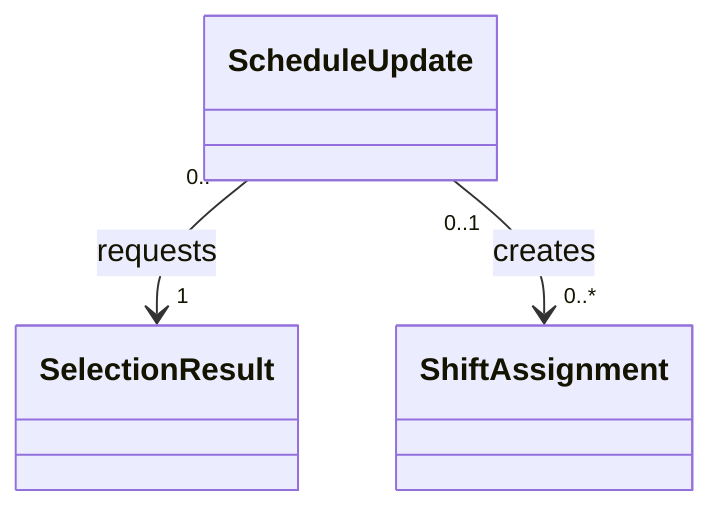

# 案05 データモデル v0.3 差分レビュー

レビュー日：2026-09-20  
対象：ユーザー提供 `proposal-05-data-model-v0.3.md`（649行）  
比較対象：v0.2および[前回レビュー](proposal-05-data-model-v0.2-review.md)

## 判定

**概念の分類は、この方向で進めてよい。集約・値・スナップショットの整理は改善している。ただし、分類変更だけでは解消しない業務条件と状態遷移が残っており、確定処理の実装前に定義が必要。**

前回の提案を全て取り込む必要はない。異なる選択でも、今回の目的と不変条件が成立すればよい。全員への個別同時打診、自然文承諾、固定RoleCode、月次上限だけを扱うデモという方針は維持した前提でレビューした。

この版がDB製品・DDL・具体的な排他実装を次段階へ送ることも妥当。ただし「どの変更を一括で確定するか」「どの時点の承諾が有効か」は論理モデルの契約なので、実装方式より先に決めたい。

## 改善した点と、採用しなくても問題ない提案

| 変更 | 評価 |
|---|---|
| Role→RoleCode | MVPの固定的な役割には適切。役割管理機能を作らずに済む |
| StaffRole・連絡許可・可能時間・月次上限をStaff内の値へ整理 | 独立した管理・履歴を必要としないMVPでは妥当。全てにIDを付ける必要はない |
| ShiftAssignmentを全勤務の正本に統一 | 二重計上・照会先の分裂を防ぐ方向。前回の指摘に対応している |
| Commitment.sourceInterpretationId | 複数の解釈から何を根拠に承諾を作ったか追えるようになった |
| 訂正時に新Commitment＋supersedesを作る | 承諾内容を上書きしない方針が明確になった |
| CoveragePlan／Item→SelectionResult | 1必要枠・1役割なら可能。前回提案のPlanItemクラスを復活させること自体は必須でない |
| ScheduleUpdateの新設 | 更新要求・結果照会・読戻しを独立に追える方向はよい |
| Message.purpose／inReplyToMessageId | 追加確認、確定・非選定・募集終了の意味を区別できるようになった |
| ProcessingEventへのログ統合 | MVPでは妥当。現在状態をイベントだけで決めないと明記した点もよい |
| CaseOutcomeへの引き継ぎ統合 | 最終結果を案件に持つ設計として妥当。過去の終了事実をどう残すかは後述 |

Staffの役割や許可を値にしたことと、変更時の整合性を不要にすることは別。値を置き換えた際に、選定済み条件を確定直前に再検査する責任は残る。

## 前回指摘の対応状況

| 前回ID | v0.3の状態 |
|---|---|
| R01 過剰配置と代表ケース | **要件の確認が必要**。例は継続し、過剰配置禁止の文言は削除された。v0.3単体の矛盾とは断定しない |
| R02 曖昧な変更中の承諾 | **未定義**。旧承諾を維持する記述は消えたが、確認中に確定対象から外す規則もない |
| R03 計画・確定・版・一括性 | **部分対応**。case.versionとScheduleUpdateが追加。対象版と一括確定の契約は残る |
| R04 同時打診の状態 | **部分対応**。Outreachの責任は明確。案件状態図は以前と同じ問題が残る |
| R05 確定・読戻し・通知・終端 | **部分対応**。通知用途と更新記録を追加。案件完了条件・照合後の状態は残る |
| R06 分断された空き時間 | **未解決**。Staffは複数可能時間を持てるが、Outreach.offeredTimeは単一区間 |
| R07 月次集計と勤務の正本 | **部分対応**。正本は解決。一部欠勤と月次集計対象は残る |
| R08 承諾の証拠と変更順 | **部分対応**。採用解釈・置換関係を追加。受信順・提示条件の固定方法は残る |
| R09 計画不足と確定不足 | **未定義**。未充足は確定ベース。途中計画の不足を表示するなら別概念が必要 |
| R10 多重度・計算値・分類 | **改善**。ただしScheduleUpdateと作成勤務の多重度に新たな不整合がある |

## 優先1：月次上限から完了済み勤務が抜け得る

対象：§4.1のShiftAssignment責務（109行）、§8の月次集計（528〜539行）。

ShiftAssignmentには「完了」のライフサイクルがある一方、集計は `scheduledの通常勤務＋confirmedの代替勤務` だけ。勤務終了後にcompleted等へ移す実装なら、その時間が月次集計から消える。

例えば月次上限160時間、今月の完了済み勤務100時間、今後の予定30時間なら、月全体の残枠は30時間。完了済みを除くと130時間まで追加できる計算になってしまう。

**必要な決定：何を制限する月次上限か。**

- 月内の勤務済み分を含む総量を制限するなら、勤務済みの時間と残る確定予定を集計する。
- 勤怠実績をMVPで持たないなら、完了済みも予定区間で数える「月次割当時間の上限」と定義する。実労働時間を計算できるとは説明しない。
- 将来予定だけの枠を制限したいなら、その意味が分かる名称と計算に変更する。月次就労総量の上限とは区別する。

一部欠勤も引き続き未定義。18〜22時のうち20〜22時だけ欠勤なら、18〜20時の120分を残す。全勤務を欠勤扱いにして除外しない。MVPで元勤務の全時間欠勤しか扱わないと制限する選択でもよい。

**最小の受入条件：** 月内で勤務の状態がscheduledからcompletedへ変わっただけでは、その勤務時間分の追加枠が復活しない。これは上記の月全体上限を選ぶ場合の条件。

## 優先2：過剰配置の扱いを明示する

対象：§2の必要人数1（42行付近）、§6.6の選定順（425〜436行）、§10の代表例（582〜587行）。

v0.2では「必要人数を超えない」という制約があり、B18〜20時とC19〜22時の採用は明確な矛盾だった。v0.3では禁止文言がないため、次のどちらなのかを確定したい。

| 方針 | B18〜20＋C19〜22 | 選定規則 |
|---|---|---|
| 必要人数を各区間でちょうど満たす | 不成立。19〜20時が2人なので条件変更の再承諾が必要 | 実行可能な計画だけを対象に、人数等で選ぶ |
| 必要人数は最低人数で、超過を許す | 成立し得る。必要4時間に対し5人時の勤務 | 全時間被覆する計画から勤務時間合計を最小化する |

どちらもプロダクト上は選べる。後者を選ぶ場合は、超過配置を事前委任に含めること、上限、全員の承諾時間を維持することを明記する。最低限「必要人数は最低人数で、MVPでは最大○人まで」等の制約を決める。人件費最適化機能を追加する必要はない。

この項目は「前回の修正を必ず取り込むべき」という指摘ではない。**代表ケースを残すために制約を変えたのか、制約の転記が漏れたのかが読めない**という指摘。

## 優先3：承諾の『最新』と『確認中』を定義する

対象：Commitment（205〜215行）、§6.5（417〜423行）、Message（277〜289行）。

新しい承諾を別IDで作る点は改善。一方で、「最新の有効版」だけでは次を決められない。

- Bが19〜22時承諾後、「21時までかも」と返信した確認中に、旧承諾を選べるか。
- Bの訂正は受信済みだがAI処理中のときに、旧承諾で確定できるか。
- 古いメッセージのAI処理が後から完了したとき、それを新しいrevisionにしてよいか。
- 複数の訂正が同じ旧Commitmentを同時に置き換えようとしたら、どちらが採用されるか。

**追記案：**

> 最新とはモデル処理の完了順ではなく、受信済みの訂正関係と案件内の適用順で判定する。確定前に、選定対象スタッフの未処理返信・確認中の変更がある場合、その承諾を確定対象から保留する。履歴は削除しない。訂正適用と確定は案件の版と共通の排他規則を守る。

MessageにreceivedAtと案件内での受信順、または同等の順序情報を定義する。occurredAtだけを信頼して最新としない。古いモデル結果を破棄する条件も必要。

原文のままの承諾を採用する方針は否定しない。ただし、Outreach内で追加確認を行うなら、どの提示条件へ答えたかをinReplyToMessageIdで辿れ、その条件が後から変わらないことを明記する。必ず別の条件テーブルや確認ボタンを増やす必要はない。

## 優先4：同時打診の状態を、案件状態図にも反映する

対象：§6.4（404〜415行）、§7（466〜510行）。

Outreachが対話スレッドになった点はよい。しかし案件全体に `追加確認中 → 引き継ぎ` が残っているため、Aへの確認が解決しないだけで、B・Cで成立できる案件まで終わる読み方が残る。

**必要な契約：** 一人の確認不成立はその人の対話結果。案件の終了は、残る承諾・候補・期限で別に判断する。

図を分離する代わりに、現在の図を「1イベントを処理する処理フロー」として扱う選択もある。その場合は、AbsenceCase.statusがそのまま同図の状態を保持するという説明を変更し、別に案件の永続状態を定義する。現在のままでは処理の段階と業務全体の状態が混ざる。

一部送信だけ失敗した場合も同様。Aへ送信済み、Bが失敗しただけで、Aからの返信を受けられなくなる終了にしない。案件終了後の返信・未採用者への通知・停止後の遅延返信についても共通の取り込み規則を設ける。

## 優先5：ScheduleUpdateの一括性・対象版・多重度を揃える

対象：§3.4（99行）、ScheduleUpdate（217〜227行）、関連（362〜363行）、§6.7（438〜450行）。

更新要求をエンティティにした点は改善。ただしexpectedScheduleVersionの参照対象がまだない。ShiftAssignment.versionは勤務1件の版であり、勤務表全体の版ではない。

論理モデルとして次の5点を決めればよい。具体的なロック構文やDB製品は後でよい。

1. 勤務表全体のrevisionを持つのか、関係する勤務・スタッフ・承諾の版を組として確認するのか。
2. 一つのSelectionResultから作る全勤務は、一括成功または一括未反映か。
3. 一案件で成功する確定操作は最大一つか。別の冪等キーでも二つの計画を成功させない制約があるか。
4. 最新状態の検査と保存の間に、別処理が勤務・月次上限・承諾を変えられない保証をどこが担うか。
5. 同じキーで異なる内容が来た場合の拒否と、成否不明時の照会先。

「別集約だから取引も必ず別にしなければならない」とは限らない。今回のローカル勤務表であれば、一つの取引を担当するアプリケーションサービスを定義する案で足りる。外部作用と呼んでいることが、外部シフトサービスとの分散更新を意味するのかも区別する。

**クラス図の具体的な修正：** 現在の `ScheduleUpdate --> "1..*" ShiftAssignment` では、要求作成直後・失敗・結果不明で作成勤務0件の状態を表せない。全ライフサイクルを示す関連は作成勤務側を0..*にし、成功時の件数一致を不変条件にする。

この抜粋は「通常勤務はScheduleUpdateから作られない」「更新要求は必ず1つの選定結果を参照する」「未成功なら作成勤務は0件」を表す。勤務側からの生成元は最大1つ。再試行を同じScheduleUpdateで管理するか別の試行記録にするかは別途固定する。

ShiftAssignmentがどのCommitmentから作られたかは、ScheduleUpdateの結果で `commitmentId → shiftAssignmentId` の対応を残せばよい。選定IDと勤務IDの配列だけでも条件から照合できる場合はあるが、対応が明示されると確認が容易。PlanItemクラスの復活は必須ではない。

## 優先6：完了・通知・確定後変更をつなぐ

対象：AbsenceCase完了条件（393〜402行）、Message用途（406〜415行）、状態図（499〜510行）。

通知の種類を追加したことで、必要な対話は表現できるようになった。ただし完了条件はまだ読戻しまでで、実際の通知受付を待たない。未採用者に募集終了を知らせる処理も、完了後にどの状態で実行するかが未定義。

送信Messageが存在することと、模擬チャネルが受け付けたことは異なる。同一Outreachには初回打診・確認・確定通知があるため、Outreach.status一つだけで全ての送信結果を表すのも難しい。

**選択肢：**

- 業務完了を読戻し＋必要な通知受付までとし、通知待ち・失敗を案件状態へ含める。
- 「シフト確定完了」と「通知完了」を別の状態として管理し、画面や集計で区別する。

いずれでも、送信ごとの現在の受付状態・メッセージキーを管理する。本文は不変のまま、配送状態を別管理にできる。ProcessingEventを現在状態の正本にしない方針なら、配送状態をログだけに置かない。

また `完了 → [*]` と `完了 → 引き継ぎ` が残っている。確定後の変更を案件の再開として扱うのか、完了事実を残して別の対応履歴を追加するのかを決める。CaseOutcomeを引き継ぎで上書きして、いつ完了したかが消えないようにする。別Handoffエンティティの復活は必須でなく、完了日時と追記履歴で扱う案でもよい。

## 優先7：単一TimeRangeで扱える入力を制限するか、区間集合にする

対象：Staff.availabilityWindows、Outreach.offeredTime、§8の候補判定。

Staffが複数のAvailabilityWindowを持てるようになっても、それらと必要時間の共通部分から既存勤務を除く結果は複数区間になり得る。Outreach.offeredTimeは単一TimeRangeのまま。

例：必要18〜22時、可能18〜22時、既存勤務19〜20時。残るのは18〜19時と20〜22時。勤務のない中間を含めた18〜22時を提示することはできない。

小さく保つ選択肢は二つ。

1. OutreachにofferedTimesを持ち、複数候補区間を提示する。Commitmentは一つの連続区間だけ、という制限は維持できる。
2. MVPでは一つの連続区間になる入力だけを扱い、それ以外は範囲外とする。

「複数の必要勤務枠は将来」という§11.2は、同じ1必要枠の中で候補の空きが分断される問題を解消しない。別の制限として明記したい。

## 後続設計へ渡せばよい確認事項

以下は分類を差し戻す理由ではない。実装契約を作るときに併せて決めればよい。

- ShiftAssignmentの更新入口は何か。勤務1件だけでなく、複数勤務の重複・月次総量をどこで守るか。
- SelectionResultが不成立・承諾0件の評価も保存するなら、Commitmentの多重度を0..*にする。成功候補だけ保存するなら現状の1..*でよい。
- SelectionResultは「選ばれた結果の記録」か「当時の全候補から同じ選定を再現できる記録」か。後者なら、候補全体・参照したプロフィールや勤務の版も必要。
- 正規化した時間・役割が同じでも、別店舗・別スタッフの承諾を参照できない所属検査。
- 欠勤者本人の除外、同じ欠勤に対する重複稼働案件の防止。
- 手動停止、案件期限、連絡・モデルの回数／費用上限を現在状態のどこで保持するか。ログを残すことと上限を守ることは別。
- 必要勤務枠は元勤務の範囲内とする。部分欠勤を扱うなら、requirement.requiredTimeが欠勤区間も兼ねることを明記。
- 役割なし・無効スタッフを保持するなら、Staff→RoleCodeの1..*を0..*にできる。全Staffに必ず役割がある仕様なら変更不要。
- 月の境界、時間帯、月次上限の欠落・負の残枠、同じ月の設定の一意性。
- 「確定していない不足」と「ある候補計画で足りない区間」を区別。後者を画面へ出さないなら概念を無理に増やさない。

## v0.3に対する最小の確認ケース

| ID | 状況 | 決める／期待すること |
|---|---|---|
| C01 | B18〜20、C19〜22 | 超過許容なら明示して成立。禁止なら追加同意なしでは不成立 |
| C02 | Bが19〜22に承諾後「21時までかも」 | 確認中に旧22時終了で確定しない |
| C03 | 訂正は受信済み、AI処理順が逆転 | 古い解釈が最新承諾を復活させない |
| C04 | A確認不能、B・Cは成立 | Aだけを理由に全案件を終了しない |
| C05 | 別キーの2つの確定要求が同時実行 | 一案件で確定する勤務集合は一つ |
| C06 | 2件の勤務作成の片方が失敗 | 部分確定を許さない方針なら全件未反映 |
| C07 | 作成成功後に応答喪失 | 同じ更新結果を照合し、再作成しない |
| C08 | 確定通知が失敗 | 確定事実を保持し、通知未完了と分かる |
| C09 | 勤務状態が完了へ変わる | 月全体上限なら、勤務時間分の枠が復活しない |
| C10 | 元18〜22、欠勤20〜22 | 部分欠勤対応なら18〜20を集計。非対応なら入力時に拒否 |
| C11 | 空きが18〜19と20〜22に分断 | 区間集合で表すか、明示的にMVP範囲外 |
| C12 | ScheduleUpdate作成直後／更新失敗 | 作成勤務0件でもモデルとして成立 |

これは設計用のケースであり、アプリの実装試験を実施した結果ではない。

## 次版への最小変更

全面的にクラスを増やす必要はない。まず本文に次の契約を足し、それに関わる図だけ直す。

1. 必要人数が「ちょうど」か「最低」かと、超過配置の許容範囲。
2. 変更確認中・未処理返信がある承諾の保留と、最新の適用順。
3. 1案件1確定、一括保存、参照版、同時変更との整合性。
4. 案件と個別対話の状態分担、更新・読戻し・通知の完了境界。
5. 月次上限の集計対象と、分断時間・部分欠勤のMVP対応範囲。

このレビューでは元のv0.3、既存RFC・ADRを変更していない。添付の分類方針を尊重し、未採用の提案そのものを不具合とは扱っていない。
