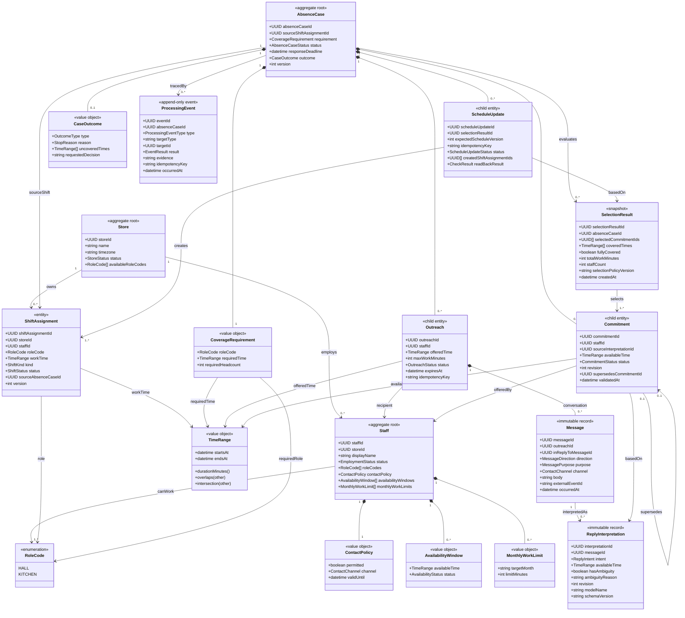
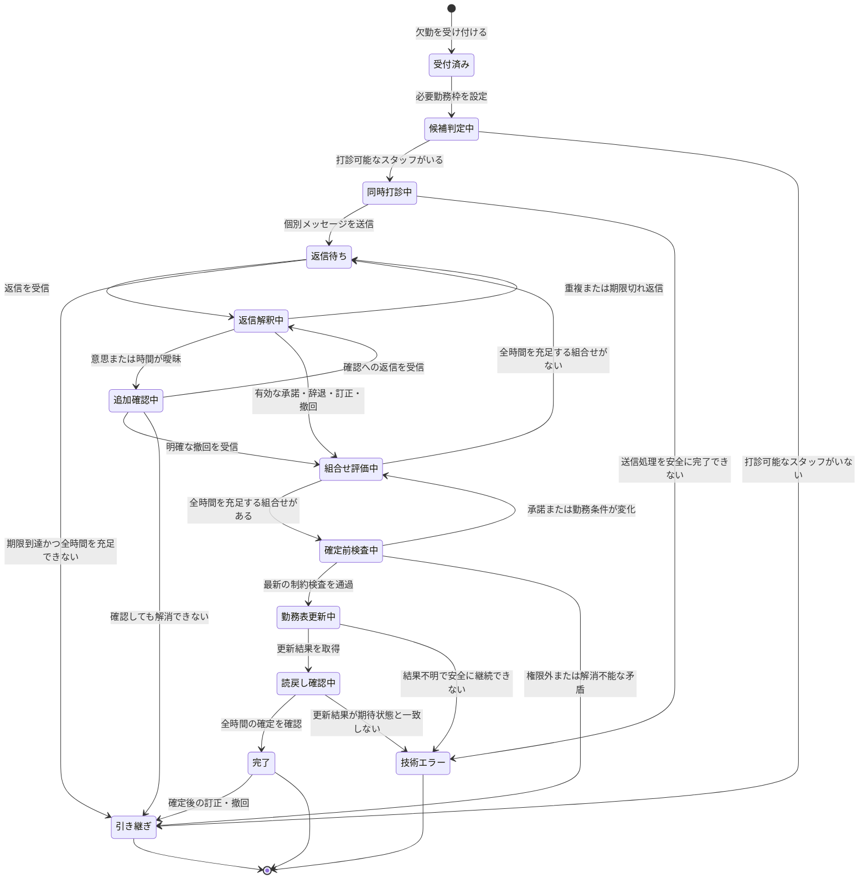

# 案05：突発欠勤対応エージェントのデータモデル

作成日：2026年9月20日  
版：0.3  
位置づけ：MVP実装に向けた概念・論理データモデル

## 1. この版の目的

版0.2では、永続化する情報を広くクラスとして表現していた。その結果、業務上のエンティティ、値オブジェクト、計算結果、通信記録、実行ログの区別が弱くなっていた。

版0.3では、各概念を次の5種類に分類し、MVPに必要なモデルへ整理する。

| 分類 | 意味 |
|---|---|
| **集約ルート** | 外部から操作するときの入口となり、集約内の整合性を守るエンティティ |
| **子エンティティ** | 集約の中で識別とライフサイクルを持つもの |
| **値オブジェクト** | 値の等価性で比較でき、独立した識別子やライフサイクルを必要としないもの |
| **不変レコード／スナップショット** | 返信、AI解釈、選定結果など、発生時点の事実や計算結果を上書きせず残すもの |
| **追記型イベント** | 操作、検査、状態変更、障害などの実行履歴 |

この版では、特に次を変更した。

- `Role`を独立エンティティから`RoleCode`へ変更した。
- `StaffRole`、`ContactPermission`、`Availability`、`StaffWorkLimit`を`Staff`に属する値として整理した。
- `CandidateEvaluation`を永続的な業務エンティティから外し、候補判定時の計算結果とした。
- `CoveragePlan`と`CoveragePlanItem`を、選定時点の`SelectionResult`へ統合した。
- `ShiftAssignment`を勤務表の正本と定義した。
- `ReplacementAssignment`を廃止し、勤務表更新の試行と結果を`ScheduleUpdate`に記録する形へ変更した。
- `AgentRun`、`ActionLog`、`ConstraintCheck`を`ProcessingEvent`へ統合した。
- `Handoff`を独立エンティティにせず、案件の終了結果`CaseOutcome`として扱う形へ変更した。
- 承諾の訂正・撤回を追跡するため、承諾の版と置換関係を追加した。
- 追加確認、確定通知、募集終了通知を表せるよう、メッセージ用途と返信関係を追加した。

## 2. 対象範囲とMVPの固定条件

対象は、架空の1店舗における1件ずつの突発欠勤、テスト用メッセージ環境、テスト用シフト表である。

MVPでは次を固定する。

- 1件の欠勤案件が扱う必要勤務枠は1つ。
- 必要勤務枠の役割は1種類。
- 必要人数は1人。
- 条件を満たすスタッフ全員へ個別メッセージを同時送信する。
- 追加確認は、同じスタッフへの打診スレッド内で行う。
- 確定前の訂正・撤回は自動で再計画する。
- 確定後の訂正・撤回は店長へ引き継ぐ。

複数役割、必要人数が複数の勤務枠、グループチャット募集、確定後の自動再調整は将来の拡張とする。

## 3. 集約境界

### 3.1 `Store`集約

店舗の識別情報と、MVPで使用する店舗設定を管理する。

- 店舗ID
- 店舗名
- タイムゾーン
- 状態
- 利用可能な役割コード

### 3.2 `Staff`集約

スタッフの識別情報と、候補判定に使用するプロフィールを管理する。

- スタッフID
- 所属店舗ID
- 表示名
- 在籍状態
- 担当可能な役割コードの集合
- 連絡ポリシー
- 勤務可能時間帯の集合
- 月次就労時間上限の集合

役割、連絡許可、勤務可能時間、月次上限は、それぞれ独立した業務主体ではないため、`Staff`に属する値として扱う。

### 3.3 勤務表

`ShiftAssignment`を勤務表の正本とする。通常勤務と欠勤補填で追加された勤務を同じ形式で管理し、勤務種別で区別する。

- 通常勤務：`regular`
- 欠勤補填による勤務：`replacement`

代替勤務を確定すると、新しい`ShiftAssignment`を作成する。欠勤案件との関連は`sourceAbsenceCaseId`で保持する。

### 3.4 `AbsenceCase`集約

欠勤調整の中心となる集約であり、次の整合性を案件単位で守る。

- 必要勤務枠
- スタッフごとの打診状態
- 有効な承諾とその版
- 承諾の訂正・撤回
- 選定結果
- シフト更新状況
- 案件の状態
- 完了、引き継ぎ、技術エラーの終了判定

`Staff`と勤務表は別の集約として扱う。打診前と確定直前に最新状態を読み、案件内に複製した古い情報だけで確定しない。

## 4. エンティティ、値、記録の一覧

### 4.1 集約ルートと子エンティティ

| クラス | 分類 | 必要な識別・ライフサイクル |
|---|---|---|
| `Store` | 集約ルート | 店舗として継続的に参照・更新される |
| `Staff` | 集約ルート | スタッフ本人として継続的に参照・更新される |
| `ShiftAssignment` | エンティティ | 勤務表の正本として作成、変更、取消し、完了を管理する |
| `AbsenceCase` | 集約ルート | 欠勤受付から完了・引き継ぎまで状態が変化する |
| `Outreach` | `AbsenceCase`内の子エンティティ | スタッフごとの送信、返信待ち、終了状態を管理する |
| `Commitment` | `AbsenceCase`内の子エンティティ | 承諾の訂正、撤回、置換、有効・無効を追跡する |
| `ScheduleUpdate` | `AbsenceCase`内の子エンティティ | シフト更新要求、成否照会、読戻しまでを追跡する |

### 4.2 値オブジェクトと列挙値

| クラス | 所属 | 内容 |
|---|---|---|
| `TimeRange` | 複数クラス | 開始日時と終了日時からなる半開区間 |
| `RoleCode` | `Store`、`Staff`、勤務情報 | `HALL`、`KITCHEN`などの役割区分 |
| `ContactPolicy` | `Staff` | 連絡可否、チャネル、有効期限 |
| `AvailabilityWindow` | `Staff` | 事前登録された勤務可能時間 |
| `MonthlyWorkLimit` | `Staff` | 対象年月と月次上限時間 |
| `CoverageRequirement` | `AbsenceCase` | 必要な役割、時間帯、必要人数 |
| `CaseOutcome` | `AbsenceCase` | 完了種別、停止理由、未充足時間、店長に求める判断 |

`CoverageRequirement`は、MVPでは1案件に1つであり、案件と別のライフサイクルを持たないため値オブジェクトとする。複数の必要枠を個別に変更・取消しする要件が生じた場合は、子エンティティへの変更を検討する。

### 4.3 不変レコードとスナップショット

| クラス | 内容 | 正本との関係 |
|---|---|---|
| `Message` | 送受信したメッセージ原文 | 外部イベントIDで重複を防ぎ、上書きしない |
| `ReplyInterpretation` | AIによる返信の構造化結果 | 原文そのものではなく、版付きの解釈結果 |
| `SelectionResult` | 承諾の組み合わせを選んだ時点の結果 | 最新の承諾から再計算可能なスナップショット |

### 4.4 追記型イベント

| クラス | 記録する内容 |
|---|---|
| `ProcessingEvent` | 案件の状態変更、候補判定、制約検査、送信、AI解釈、選定、更新、読戻し、障害 |

`ProcessingEvent`は、業務上の現在状態を決める正本ではない。処理の再現、監査、障害調査、デモでの根拠表示に使用する。

## 5. UMLクラス図



## 6. クラスごとの責務

### 6.1 `Staff`

候補判定に必要な現在のプロフィールを持つ。候補者の順位や案件ごとの評価結果は持たない。

`RoleCode`は値の等価性で判断する。例えば必要役割が`HALL`で、スタッフの`roleCodes`に`HALL`が含まれれば、役割条件を満たす。

`AvailabilityWindow`は事前登録された勤務可能時間である。スタッフから案件ごとに届いた承諾は、`Staff`ではなく`Commitment`に保存する。

`MonthlyWorkLimit`は対象年月と上限時間の組であり、月ごとに値が変わり得る。実際の予定就労時間と残り時間は勤務表から計算する。

### 6.2 `ShiftAssignment`

勤務表に存在する正式な勤務予定を表す。通常勤務と代替勤務を同じクラスで管理する。

代替勤務を確定すると、選ばれた承諾ごとに`kind = replacement`の`ShiftAssignment`を作成する。元の欠勤案件は`sourceAbsenceCaseId`で追跡する。

次は勤務表から計算する。

- 既存勤務との重複
- 月次予定就労時間
- 月次残り就労可能時間
- 確定済みの代替勤務

### 6.3 `AbsenceCase`

案件の状態遷移と、欠勤調整に関する整合性を管理する。

案件を完了にできるのは、次のすべてを満たす場合だけである。

1. 必要時間全体を覆う有効な承諾の組み合わせが選ばれている。
2. 確定直前の制約検査を通過している。
3. 選定結果に基づく勤務表更新が成功している。
4. 作成された勤務を読み戻し、期待した内容と一致している。

### 6.4 `Outreach`

1人のスタッフに対する打診から終了までの通信スレッドを表す。初回打診だけでなく、曖昧な返信への追加確認、確定通知、非選定通知、募集終了通知も同じ`Outreach`に属する。

`Message.purpose`の例は次のとおり。

- `initial_offer`
- `clarification_request`
- `staff_reply`
- `confirmation_notice`
- `not_selected_notice`
- `recruitment_closed_notice`

### 6.5 `Commitment`

本人の返信から勤務意思と時間を一意に決定でき、条件検査を通過した承諾を表す。返信原文ではなく、採用した`ReplyInterpretation`を根拠にする。

訂正が届いた場合は既存の承諾を上書きしない。新しい`Commitment`を作成し、`supersedesCommitmentId`で以前の承諾を参照する。以前の承諾は`superseded`、明確に撤回された承諾は`withdrawn`とする。

同一案件・同一スタッフについて、組み合わせ選定に使用できる承諾は最新の有効版だけとする。

### 6.6 `SelectionResult`

ある時点の有効な承諾から、必要時間を埋められる組み合わせを計算した結果である。業務上の正本ではなく、再現可能な選定スナップショットとして保存する。

全時間を充足する組み合わせが見つかった場合、次の順で選ぶ。

1. 承諾された勤務時間の合計が短い。
2. 合計時間が同じなら、必要なスタッフ数が少ない。
3. それでも同じなら、組み合わせを構成する承諾が揃った時刻が早い。
4. さらに同じなら、スタッフIDなど一定の値で決める。

スタッフが承諾した時間を、本人への確認なしに短縮しない。

### 6.7 `ScheduleUpdate`

選定結果を勤務表へ反映する外部作用を追跡する。

- 選定結果ID
- 更新前に確認した勤務表の版
- 冪等キー
- 更新要求の状態
- 作成された勤務ID
- 読戻し結果

更新応答が失われた場合は、同じ要求を直ちに再実行せず、冪等キーまたは作成済み勤務IDで結果を確認する。

### 6.8 `ProcessingEvent`

次の記録を共通形式で追記する。

- 案件状態の変更
- 候補に含めた理由、除外した理由
- メッセージ送信結果
- AI解釈の開始・成功・失敗
- 勤務重複や月次上限の検査結果
- 組み合わせ選定結果
- 勤務表更新と読戻し結果
- 引き継ぎまたは技術エラー

検査内容を個別に検索・集計する必要が生じた場合は、将来`ConstraintCheck`などへ分離できる。

## 7. UML状態遷移図

状態遷移は版0.2の方針を維持する。クラス分類の変更に合わせ、処理名だけを整理した。



## 8. 候補判定と制約検査

`CandidateEvaluation`は永続的な業務エンティティにしない。候補判定サービスが次を計算し、必要な根拠だけを`ProcessingEvent`へ記録する。

### 打診可能な条件

- スタッフが在籍中である。
- 必要な`RoleCode`がスタッフの`roleCodes`に含まれる。
- 未充足時間と`AvailabilityWindow`に共通部分がある。
- 通常勤務および確定済み代替勤務と重複しない時間がある。
- 対象月の残り就労可能時間がある。
- `ContactPolicy`で連絡が許可されている。
- 同じ案件で明確に辞退していない。

条件を満たすスタッフ全員へ、個別メッセージを同時送信する。候補順位は持たない。

### 月次上限の計算

```text
現在の予定就労時間
＝ scheduled状態の通常勤務
＋ confirmed状態の代替勤務

残り就労可能時間
＝ MonthlyWorkLimit.limitMinutes
－ 現在の予定就労時間
```

欠勤・取消済みの勤務は予定就労時間に含めない。残り時間が0なら打診対象外とする。一部だけ勤務できる場合は、打診時に最大勤務時間を伝え、具体的な時間帯を回答してもらう。

スタッフが最大勤務時間を超える時間を回答した場合、システム側で自動的に短縮せず、上限内の具体的な時間帯を追加確認する。

打診前と確定直前の両方で、勤務の重複と月次上限を検査する。

## 9. 正本、計算値、履歴の区別

| 情報 | 扱い |
|---|---|
| スタッフの現在プロフィール | `Staff`が正本 |
| 正式な勤務予定 | `ShiftAssignment`が正本 |
| 欠勤調整の現在状態 | `AbsenceCase`が正本 |
| メッセージ原文 | `Message`として不変保存 |
| AIによる返信解釈 | `ReplyInterpretation`として版付き保存 |
| 有効な承諾 | `AbsenceCase`内の最新`Commitment` |
| 組み合わせ選定 | `SelectionResult`としてスナップショット保存 |
| 勤務表への反映過程 | `ScheduleUpdate`で追跡 |
| 未充足時間 | 必要勤務枠と確定済み勤務から計算 |
| 補填可能時間 | 未充足時間、勤務可能時間、既存勤務、月次残時間から計算 |
| 月次予定就労時間 | `ShiftAssignment`から計算 |
| 候補判定 | 実行時に計算し、根拠を`ProcessingEvent`へ記録 |
| 操作・検査・状態変更の履歴 | `ProcessingEvent`へ追記 |

計算値を画面表示や監査のために保存する場合も、確定判断では最新の正本データから再計算する。

## 10. MVPの最小データセット

- 店舗：1件
- 役割コード：`HALL`
- スタッフ：欠勤者1人、代替候補3人以上
- スタッフごとの担当可能役割、連絡ポリシー、勤務可能時間、月次上限
- 元勤務：18〜22時の通常勤務1件
- 欠勤案件：18〜22時の1件
- 必要勤務枠：`HALL`、18〜22時、1人
- 条件を満たすスタッフ全員への個別打診
- 辞退、全時間承諾、部分承諾、曖昧な返信、訂正・撤回の返信
- 返信ごとのAI解釈と、有効な承諾の版
- 組み合わせの選定結果
- 選定結果に基づいて作成された代替勤務
- 送信、解釈、検査、選定、更新、読戻しの処理イベント

組み合わせ選定の代表ケースは次のとおり。

- A：19〜21時を承諾
- B：18〜20時を承諾
- C：19〜22時を承諾
- A・B・Cの3人を確定せず、B・Cの組み合わせで18〜22時を補填する

## 11. 今後の検討事項

### 11.1 役割のエンティティ化

次の要件が生じた場合は、`RoleCode`から`Role`エンティティへの変更を検討する。

- 店舗ごとに役割を追加・名称変更する。
- 役割を有効化・廃止する。
- 役割ごとの最低人数や勤務条件を設定する。
- 役割変更の履歴を監査する。

### 11.2 複数の必要勤務枠

複数役割、複数区間、必要人数が複数の案件を扱う場合は、`CoverageRequirement`を子エンティティに変更し、承諾、選定結果、確定勤務がどの必要枠を満たすかをIDで関連付ける。

### 11.3 人件費を考慮した組み合わせ選定

将来は、時間単価、残業、深夜割増、交通費、最低勤務時間などを考慮し、欠員補填に必要な人員構成を評価する余地がある。店舗が管理する費用情報、給与情報へのアクセス権限、スタッフへの説明可能性、公平性を確認したうえで選定規則を拡張する。

### 11.4 詳細な勤務制約

今後検討する制約として、次を記録する。

- 日次・週次の労働時間上限
- 時間外労働と残業時間
- 連続勤務日数
- 勤務間インターバル
- 休憩時間
- 深夜勤務
- 年齢や雇用契約による勤務可能時間
- 複数店舗での勤務時間の合算
- 役割ごとの最低人数や責任者配置

これらを追加する場合は、法令上の制約と店舗内の運用ルールを区別する。

### 11.5 グループチャットと確定後の再調整

グループチャット募集を追加する場合は、グループ参加者、投稿と案件の関連付け、返信の公開範囲、募集終了後の返信を設計する。

確定後の撤回を自動処理する場合は、新しい欠勤案件として元案件へ関連付け、再連絡の許可、期限、以前辞退したスタッフの扱い、再調整回数の上限を定める。

## 12. 物理設計へ進む前の確認事項

この版では、次の詳細設計には進まない。

- 使用するデータベース製品
- 物理テーブル、インデックス、パーティション
- SQLのDDL
- APIのリクエスト・レスポンス形式
- 画面ごとの表示項目
- 本番の個人情報保持期間と削除方式
- 労務・法令に基づく勤務制約の完全な実装

次の段階では、集約ごとの永続化単位、外部メッセージと勤務表更新の境界、同時更新時の排他制御を具体化する。

## 参照資料

- [案05：突発欠勤対応エージェントのユーザーストーリーとMVPスコープ](./proposal-05-mvp-scope.md)
- [案05：突発欠勤対応エージェントのデータモデル 版0.2](./proposal-05-data-model-v0.2.md)
- `hackathon-decision.md`（2026年9月19日作成）

