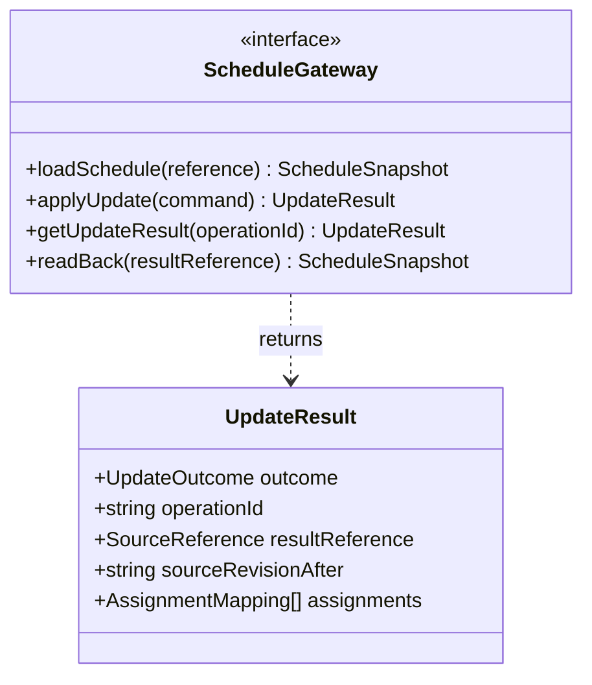

# 案05 データモデル v0.4 差分レビュー

レビュー日：2026-09-20  
対象：ユーザー提供 `proposal-05-data-model-v0.4.md`（745行）  
比較：[v0.3レビュー](proposal-05-data-model-v0.3-review.md)

## 判定

**Scheduleの追加、内部版と外部版の分離、GatewayとAdapterの境界は改善している。一方、CSV出力を業務上の確定にする契約が未定義で、ここを先に決めたい。**

今回の大きな変更はクラス追加そのものではなく、「内部勤務表が正本」から「外部CSVが原本」への移行である。そのため、更新版の正式採用、参照先の切替え、更新結果の照会、CSVと内部記録の障害復旧が新たに必要になる。

CSVを選んだこと自体を問題とはしない。元ファイルを残す設計も妥当。MVPをCSVと模擬メッセージに限定し、SaaS・LINEを今は実装しない方針も維持してよい。

## 改善した点

| 変更 | 評価 |
|---|---|
| Schedule集約とShiftAssignment子エンティティ | 勤務表全体の所有者と内部versionの意味が明確になった |
| expectedScheduleVersionとexpectedSourceRevision | 内部の競合と外部原本の変更を区別できるようになった |
| ScheduleUpdate→作成勤務が0..* | 更新前・失敗時の作成勤務0件を表現できるようになった |
| ContactEndpointの追加 | 許可だけでなく、登録された宛先の参照を表現できる |
| ScheduleGateway／MessagingGateway | ベンダー固有の形式をドメインから分ける方針は適切 |
| 内部の業務クラス図と連携クラス図を分離 | 概念モデルと入出力責任を別々に確認しやすい |
| OrcaRouterをMVP接続に明記 | ハッカソンの必須利用条件が文書に入った |

前回の「完了済み勤務が月次集計から必ず抜ける」という特定の算式は削除された。したがって同じ不具合を断定しない。ただし、新しい「有効な勤務」にどの状態・時間を含めるかは未定義である。

## 今回の主要指摘

P1はMVPの確定・制約検査の正しさに関わる項目。P2は連携契約の明確化であり、将来の接続実装を今増やす指示ではない。

| ID | 優先度 | 対象箇所 | 指摘 |
|---|---|---|---|
| N01 | P1 | §3、§9.2、§10／40〜49、512〜526、534〜548行 | 出力CSVが新しい正式原本になるのか、変更案なのか未定義 |
| N02 | P1 | §9.1〜9.3、§10／501〜546行 | 直前の版比較だけでは、比較後の変更・二重確定を防げない |
| N03 | P1 | ScheduleGateway／409〜428行、§10 | 更新の照会先と読戻し先が契約に不足する |
| N04 | P1 | §8.2、§14、§15／497〜499、680台、699行 | 日単位の原本に対し、月次上限・日跨ぎ重複を検査する取得範囲が不足 |
| N05 | P1 | ShiftAssignment.externalAssignmentId、§9.2 | IDのないCSVを再読込したときの勤務IDの継続性が未定義 |
| N06 | P2 | SourceCapabilities／282〜290行、§9.3 | 機能フラグだけでは安全に自動更新できるか判断できない |
| N07 | P2 | ContactEndpoint、MessagingGateway、Message | 宛先の版、受信者照合、非メッセージイベント、送信結果の扱いを分けたい |

## N01：別ファイル出力の正式採用を定義する

§9.2は元CSVを残して更新版CSVを出力し、§10は成功後に案件を完了とする。しかしSchedule.sourceReferenceが次にどのファイルを指すかは書かれていない。

### 起こること

1. 元CSV「R1」を読み込み、Bの勤務を追加した「R2」を出力する。
2. 案件を完了する。
3. 次の案件または再起動で、sourceReferenceから再びR1を読む。
4. Bの追加勤務が見えず、重複勤務や月次上限の検査から漏れる。

同時案件を1件にしても、連続する案件や復旧で発生する。R2を読戻せたことだけでは、今後R2が使われる保証にならない。

### 選べる二つの契約

| 方針 | 完了の意味 | 必要な扱い |
|---|---|---|
| A：更新版CSVをデモ勤務表の正式版として採用 | 模擬環境の勤務確定 | 最新正式版を指す参照を保存し、次回取得も必ずその版を使う |
| B：更新版CSVを人が取り込む変更案として出力 | 提案・ファイル出力完了 | シフト反映済みとはしない。実際の採用・反映を別状態として扱う |

元の「追加の店長操作なしで確定」を示す目的にはAが合う。Aでも元CSVを保存できる。過去版を残すことと、最新正式版の参照を更新することは両立する。

**Aの最小追記案：**

> MVPでは取り込んだCSVを不変な版として管理し、更新版を検証した後、アプリが管理する正式版の参照を切り替える。全ての勤務照会・次案件・再起動は正式版を参照する。元ファイルを直接編集して勤務を変える運用はせず、変更は新しい版として取り込む。

この管理範囲を合意できない場合、出力ファイルを自動的に正式勤務とみなさない。

## N02：版の確認と確定を、競合に対して一つの操作にする

内部版と外部版を分けたことはよい。ただし、版を比較した後で確定するまでに状態が変わる余地がある。

- 元CSVのhashを確認した直後に、そのファイルが編集される。
- 2つの処理が同じ内部版・外部版を確認し、それぞれ別の更新CSVを作る。
- 承諾確認後、CSV出力中に訂正・撤回が受信される。

再取得と比較は変更の検出であり、比較した版に対してだけ更新を成立させる保証とは別である。ファイルのhashを何度か読み直すだけでは、その間隙をなくせない。

### CSVのMVPで必要な契約

N01のAを選ぶなら、管理下の不変ファイルと正式版参照を使い、正式版切替え時に期待版・案件版・承諾の有効性を再検査する。別処理が既に正式版を進めた場合は採用しない。案件ごとに正式採用できる選定結果は一つとする。

出力ファイルと内部DBを一つの通常のDB取引で更新できるとは仮定しない。例えば次の順序なら責任を分けられる。

1. 操作IDと固定した更新内容を記録する。
2. 非公開の作業用出力としてCSVを作成・保存し、読み戻して検査する。まだ正式勤務にはしない。
3. 内部の一つの取引で、正式版参照、内部勤務表、案件の確定事実、ScheduleUpdateの結果、通知待ちを揃えて保存する。この直前に必要な版・承諾・期限を再検査する。
4. 3に失敗した出力は未採用ファイルとして残るだけ。次回参照や通知には使わず、整理対象にする。

これは設計案でありDB方式の指定ではない。重要なのは「ファイル作成」と「正式採用」を分けること。複数の割当の一部だけを正式採用しない。

### 将来のSaaS

読み取ったETagやhashをクライアント側で比較するだけでは、外部サービス側の同時変更を防げない。外部サービスが期待版を更新時に検証するか、他の排他契約が必要。版なしSaaSにhashを付けただけで同じ保証になるとは説明しない。

## N03：更新後参照と操作照会をGatewayの契約に含める

現在のScheduleGatewayにはloadSchedule、applyUpdate、readBackがある。本文では「冪等キーで結果照会する」と要求しているが、その操作がインターフェースにない。

また、`readBack(sourceReference)`に元CSVの参照を渡せば、更新前のファイルを読む。更新後の参照先をどこから受け取るかが未定義。応答喪失時は、作成勤務IDや出力ファイル名も呼び出し元が受け取れていない可能性がある。

### 最小限の追加契約案

| 契約 | 必要な情報 |
|---|---|
| 更新コマンド | operationId、同じIDの内容を固定するrequestHash、元原本参照、期待版、作成する勤務内容 |
| 更新結果 | 適用済み／未適用／競合／成否不明／一部適用／出力のみの区別、更新後参照、更新後版、勤務IDの対応 |
| 操作照会 | operationIdから以前の結果を取得。まだ成否を判断できない場合を「存在しない＝未実行」と断定しない |
| 読戻し | 更新結果が指す版・成果物を読み、期待勤務を確認。元参照を黙って再利用しない |

CSVの操作IDに対応する出力を決定的に特定できれば、同じ処理をやり直すときにも照合できる。列定義をこの文書へ全部追加する必要はない。

ScheduleUpdateの子エンティティをそのままadapterへ渡す構成もMVPでは可能だが、その中には選定ID等の参照しかない。adapterが案件内部を自由にたどる必要がないよう、実際に作成する勤務内容を固定したコマンドへ展開してから渡す方が責任を限定できる。

図は契約の抜粋。具体的な引数の型・API形式・例外形式は次段階でよい。ScheduleUpdate.statusは、これらの成否と内部の正式採用状態を対応付ける必要がある。

## N04：日単位の版だけでは月次上限・日跨ぎを守れない

Scheduleを1店舗・1営業日とする選択は妥当。ただし、判定の対象範囲は日単位の集約より広い。

### 月次集計の入力が足りるか

§8.2では対象月の複数Scheduleを使うが、§15の最低データは1営業日だけ。月内の他の日を取得していない状態と、他の日に勤務がない状態は区別する必要がある。

1日しか読めていないのに「月次上限内」と判定すると、取得できていない勤務を0時間としてしまう。デモで他の日が空なら、「対象月全体のデータが揃っており、他の日は空」という前提をfixtureに持たせる。あるいは複数営業日のfixtureを用意して月次計算を検証する。

### 対象日の版だけでは検査根拠全体を表さない

20日の勤務を確定する際、21日の勤務が途中で追加されれば月次残枠が変わる。20日のSchedule.versionとsourceRevisionだけを比較しても検知できない。スタッフの月次上限変更も同様。

MVPでは、参照した対象月の入力を処理中は不変にし、変更取込みは同じ管理経路を通す制限でよい。複数原本が自由に更新される運用に進むなら、検査に使った版の集合、データ取得範囲・完全性、取得不能時の停止を定義する必要がある。日付を変えただけで検査対象をすり抜けられないようにする。

### 日跨ぎ

§8.1で日跨ぎを許しているため、19日営業日の23時〜翌2時と、20日営業日の1〜3時は異なるSchedule内で重複する。§8.2の「対象Scheduleから重複を計算」と§14の「複数Scheduleから計算」を揃え、実時間区間が交差する勤務を検索する。月跨ぎは店舗の時刻基準で各月の区間へ分割する。

4日間のMVPでは日跨ぎを拒否する選択でもよい。その場合、§8.1は将来仕様として区別する。以前から残る「完了済み勤務を月次に含めるか」「一部欠勤をどの区間から除くか」も、ここで集計契約として固定したい。

## N05：CSV再取込みでも同じ勤務を同じ勤務として識別する

`externalAssignmentId`はCSVにない場合は空でよいとされている。一方、案件は内部のsourceShiftAssignmentId、更新結果はcreatedShiftAssignmentIdsを持つ。

取込みごとに新しいUUIDを付けるだけだと、同じ元勤務を指す案件が再取込み後に辿れない。勤務の時刻・担当者が変更された場合、内容のhashだけでは同じ勤務の変更なのか、新しい勤務なのか判断できない。行番号も並べ替えで変わる。

**MVPの推奨契約：**

- 取込みCSVには安定した勤務IDを必須とする、または初回取込みでID付きの正規化CSVを生成し、その版以降を管理原本にする。
- 出力CSVにもそのIDを保持する。追加勤務は更新操作から決まるIDを一度発行し、再試行で作り直さない。
- 職員表示名ではなく安定したstaffIdで紐づける。日付・時刻・役割・状態も読戻しで同じ意味に復元できることを条件にする。
- 勤務内容の変更と勤務IDの変更を区別する。再取込み時に既存案件・承諾の参照を黙って別勤務へ付け替えない。

具体的な列名は次段階でよいが、IDを往復して保持できることは今のモデルの成立条件。

sourceRevisionについて、内容hashと取込IDは同じ意味ではない。任意の取込IDだけでは外部ファイルの変更を検出できない。取込IDを使うなら、不変な内容へ一意に結び付いた管理版IDとして定義する。読むたびに新IDを発行して、同じ内容まで「変更」と誤判定しない。

## N06：Capabilityは、対応しないときの動作まで決める

将来の接続先の違いを表す値としてSourceCapabilitiesを置くことは妥当。ただし、現状のbooleanだけでは次を区別できない。

- 読むことはできるが、書き込めない。
- 1勤務ずつ追加できるが、複数勤務の一括確定はできない。
- 版を読むことはできるが、期待版を指定した条件付き更新はできない。
- 冪等キーを送信できるが、応答喪失後の結果照会はできない。
- CSVへ出力はできるが、元SaaSへ反映はしていない。

§9.3の「更新APIがなければCSVへ出力」を許す場合、外部原本へ反映済みとして完了させない。UpdateResultに `EXPORTED_ONLY` 等の明確な区別を持たせる。

**MVPで必要なのはCSVの保証を固定すること。** 将来用には、条件付き更新、一括適用、操作照会、出力のみのモードという必要な能力を書き残せば足りる。未対応SaaS向けの補償取引を今実装する必要はない。

## N07：連絡先の現在値と、実際に送った相手を区別する

ContactEndpointの導入は改善。一方、OutreachがendpointKeyだけを参照していると、同じkeyのexternalRecipientIdが変更された際、後続の確認・確定通知が別の相手へ届き得る。

値オブジェクトとして扱うことは問題ない。次のどちらかを決めればよい。

- endpointKeyが示す宛先は不変とし、宛先変更時は新しいkeyを作る。
- Outreachや送信記録に、使用した宛先の版・不変なスナップショットを保持する。

どちらの場合も、送信直前は現在の連絡許可が有効かを確認する。過去に許可された宛先だからと、撤回後に送り続けない。受信は、案件・打診IDの指定だけでなく、検証済みの送信者と登録スタッフを照合する。

外部イベントIDの重複キーは、サービス・connectionId等の識別範囲と組にする契約が必要。全サービスのイベントIDが一つの共通空間で一意とは仮定しない。

`receiveEvent(externalEvent) Message`はMVPの模擬返信には使える。ただし将来のLINE等では、すべての受信イベントが本文付きMessageとは限らない。無視するイベント、メッセージ以外の制御イベント、署名・送信者の検証失敗を表す戻り値を別途設計する余地を残す。「モデルは一切変更しない」とまで約束せず、業務モデルの中心を維持する方針、とするのがよい。

メッセージ本文は不変、配送状態は更新・照会される、という違いも残る。本文保存済みを送信受付済みとしない。

## 前回から残る業務上の確認

外部連携を整理しても、以下は解消しない。v0.3レビューの該当内容を再掲する代わりに、今回の必要な決定だけ示す。

| 項目 | v0.4の状態 | 今決めること |
|---|---|---|
| 過剰配置 | 代表ケースも削除され、最低人数／上限人数の意味は未定義 | 各区間ちょうど1人か、1人以上で超過を許すか |
| 曖昧な訂正・未処理返信 | 「最新の有効版」だけ継続 | 保留中の承諾を確定へ使わない規則、受信順とモデル完了順の分離 |
| 同時打診の状態 | 案件全体の追加確認不能→引き継ぎが継続 | 一人の確認失敗と全案件の終了を分ける |
| 手動停止 | 図と中心モデルに明示なし | 停止成立後の新規送信・正式採用を止める。採用済み勤務は自動取消しない |
| 分断した空き時間 | offeredTimeは単一区間のまま | 区間集合にするか、分断入力をMVPで拒否する |
| 確定と通知 | 読戻し後に即完了 | 通知完了を別管理するか、業務完了に必要通知の受付を含める |
| 成否不明の復旧 | 技術エラー→終端が継続 | 確定済み／未確定を不明のまま潰さず、照合後の遷移先を持つ |
| 完了後の訂正 | 完了→終端と完了→引き継ぎが併存 | 完了事実を保持した別の対応履歴か、要対応状態への移行か |

これらをすべて別クラスへする必要はない。定義・注記・少数の状態追加で足りる箇所もある。状態遷移図は、次のクラス追加より優先して業務方針と揃えたい。

## 4日間のMVPとして推奨する制限

1. CSVを、取り込んだ後はアプリ管理下の不変な版として扱う。
2. 更新版の作成・検査と、正式版への採用を分ける。
3. 正式採用と内部状態の更新を一つの管理経路で行い、次回の読込先を固定する。
4. 安定した勤務IDを入出力で保持する。
5. 月次のデータが揃った架空fixtureを使用する。日跨ぎを扱わないなら入力時に拒否する。
6. SaaS・LINEはinterfaceと未実装の範囲を示すだけにし、接続実装・運用保証を追加しない。

現状はこれだけで、CSVを使った実演の正しさをかなり明確にできる。汎用的な外部連携基盤を完成させる必要はない。

## v0.4の確認用ケース

| ID | 状況 | 期待する動作 |
|---|---|---|
| T01 | R1からR2を作り、次の案件を開始 | R2の追加勤務を参照する。R1へ戻らない |
| T02 | R2出力成功後、正式採用前に停止 | R2を正式勤務と数えない。未採用出力として残す |
| T03 | 正式採用直後、応答を返す前に停止 | 再起動後に採用済み結果を照合。重複追加しない |
| T04 | 同じR1から2つの更新が同時に正式採用を試みる | 一方だけ採用。もう一方は版不一致で再検査 |
| T05 | CSV出力中に本人の訂正を受信 | 正式採用前に保留・失効を検知する |
| T06 | CSVの行を並べ替えて再読込 | 勤務IDと案件の参照先が同じ勤務を指す |
| T07 | 作成応答が失われ、外部勤務IDが未取得 | 操作IDから結果または照合必要状態を取得 |
| T08 | 出力CSVを読戻すはずが元CSVを参照 | 反映確認失敗として扱い、完了にしない |
| T09 | 対象月の1日しか取得していない | 他の日を0と推定せず、不足データとして止める。ただし月内他日が空と宣言された完全fixtureは可 |
| T10 | 別営業日の勤務追加で月次残枠が減る | 固定スナップショットの規則で更新を排他するか、関連版変更で再検査 |
| T11 | 前営業日23〜翌2時と当日1〜3時 | 日跨ぎ対応なら重複検出。非対応なら入力時に拒否 |
| T12 | 読取専用SaaSからCSVへ出力 | 出力完了とSaaS反映完了を区別する |
| T13 | 同じendpointKeyの宛先を変更 | 新しいkeyまたは版を要求し、旧打診を別人へ転送しない |
| T14 | 同じ外部イベントIDが異なるconnectionから届く | 接続範囲を含む重複キーで誤って片方を捨てない |

これらは設計検証用の反例で、アプリの実行試験結果ではない。Mermaid図は契約を示す抜粋であり、描画検証は行っていない。

## 次版へ進む条件

最優先は「どのCSVが正式版か」「いつ正式採用が成立するか」「再起動後にどこを読むか」の3点。これが定まれば、ScheduleGatewayの戻り値・照会とScheduleUpdateの状態を決められる。

その上で、月次データの範囲、勤務IDの継続性、残っている承諾・対話状態の契約を揃える。物理設計を並行して検討すること自体は可能だが、これらを未定義のまま自動確定の実装を固定しない。

原文v0.4と既存RFC・ADRは変更していない。今回のレビューは方針の選択肢と不整合の指摘であり、CSV方式への変更を採用済みADRとして書き換えたものではない。
