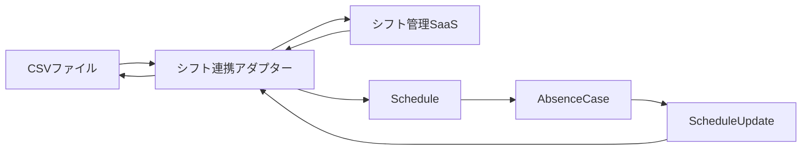
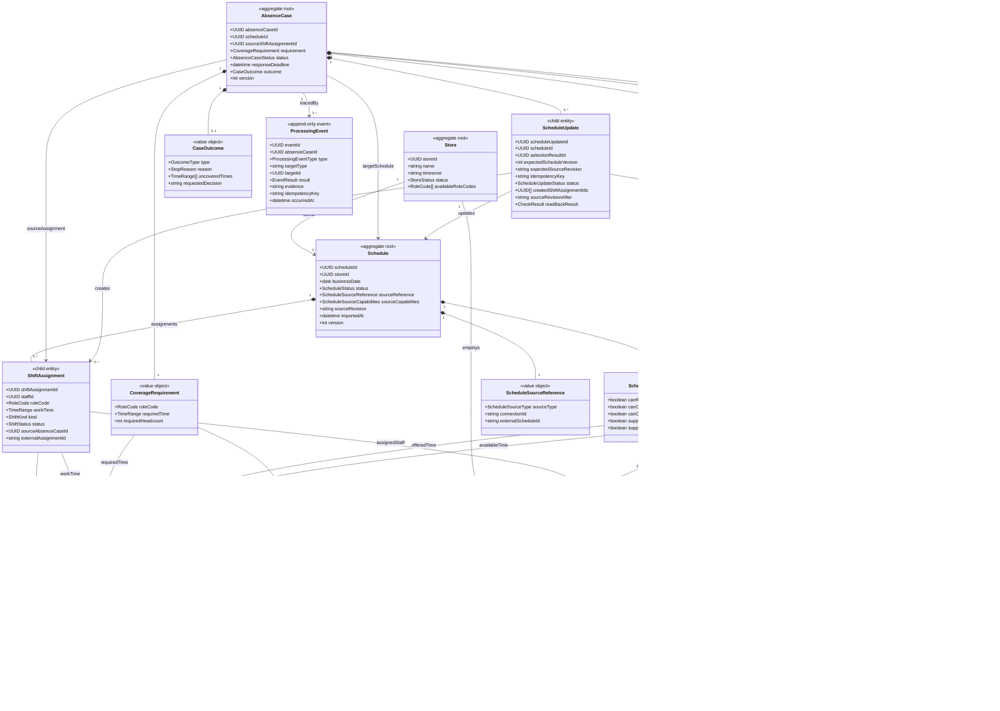
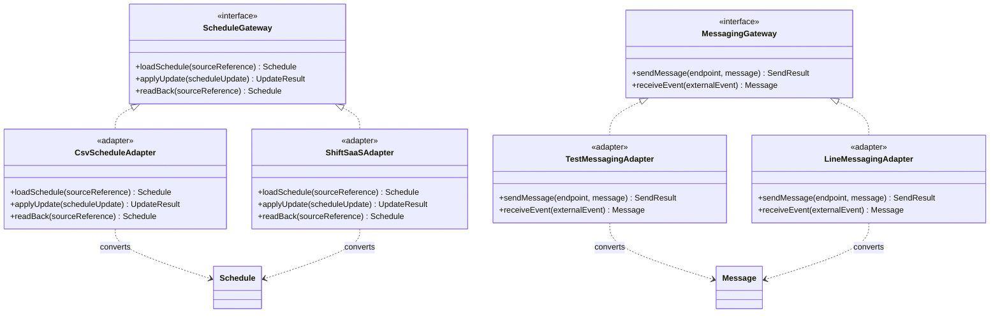
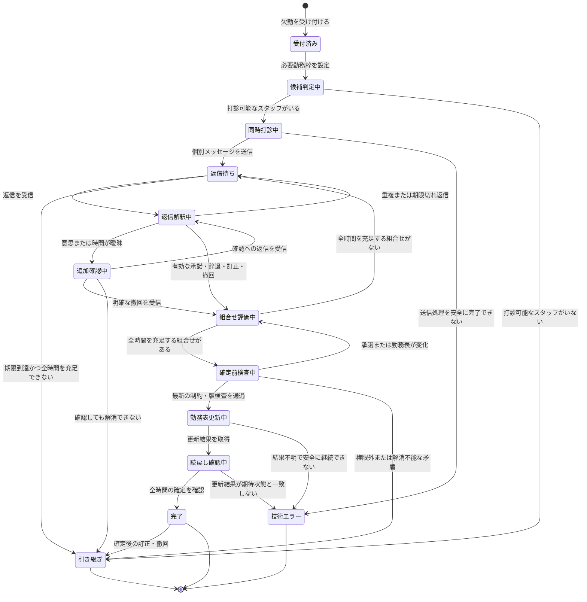

# 案05：突発欠勤対応エージェントのデータモデル

作成日：2026年9月20日  
版：0.4  
位置づけ：MVP実装に向けた概念・論理データモデル

## 1. この版で追加・変更した内容

版0.3のエンティティ分類と集約境界を維持し、勤務表の原本と外部連携を明確にした。

- `Schedule`を勤務表の集約ルートとして追加した。
- `ShiftAssignment`を`Schedule`内の子エンティティへ変更した。
- CSVまたはシフト管理SaaSを、勤務表の外部原本として扱えるようにした。
- 内部の勤務表版と、外部原本のリビジョンを分けた。
- CSVとシフト管理SaaSの差を`ScheduleGateway`と各アダプターで吸収する構成にした。
- スタッフの連絡許可に加え、登録済みの送信先を表す`ContactEndpoint`を追加した。
- LINEとテスト用メッセージ環境の差を`MessagingGateway`と各アダプターで吸収する構成にした。
- `ScheduleUpdate`に、対象勤務表、期待する内部版、期待する外部リビジョン、外部反映後の読戻し結果を追加した。

MVPではCSVとテスト用メッセージ環境を使用し、既存シフト管理SaaSとLINEへの接続は、同じ境界を使う将来の連携先として扱う。

## 2. 対象範囲と固定条件

対象は、架空の1店舗における1件ずつの突発欠勤である。

MVPでは次を固定する。

- 1件の欠勤案件が扱う必要勤務枠は1つ。
- 必要勤務枠の役割は1種類。
- 必要人数は1人。
- 条件を満たすスタッフ全員へ個別メッセージを同時送信する。
- 追加確認は、同じスタッフへの打診スレッド内で行う。
- 確定前の訂正・撤回は自動で再計画する。
- 確定後の訂正・撤回は店長へ引き継ぐ。
- シフト原本はCSVとし、更新版を別ファイルとして出力する。
- 連絡はテスト用メッセージ環境で模擬する。

将来は、勤務表の入出力をシフト管理SaaSへ、連絡をLINEへ置き換えられる構造とする。

## 3. シフト情報の3層

シフト情報を、外部の原本、内部の共通モデル、外部反映の記録に分ける。

| 層 | 役割 |
|---|---|
| 外部の原本 | CSVファイルまたは既存シフト管理SaaS |
| `Schedule` | 外部データを共通形式へ変換し、AIが参照する勤務表 |
| `ScheduleUpdate` | 選定結果を外部の原本へ反映した処理と結果の記録 |

CSVや特定SaaSの列名、API形式、認証方式はドメインモデルへ含めない。各アダプターが外部形式を`Schedule`へ変換する。

## 4. 分類と集約境界

### 4.1 分類

| 分類 | 意味 |
|---|---|
| **集約ルート** | 外部から操作するときの入口となり、集約内の整合性を守るエンティティ |
| **子エンティティ** | 集約の中で識別とライフサイクルを持つもの |
| **値オブジェクト** | 値の等価性で比較でき、独立した識別子やライフサイクルを必要としないもの |
| **不変レコード／スナップショット** | 発生時点の事実や計算結果を上書きせず残すもの |
| **追記型イベント** | 操作、検査、状態変更、障害などの実行履歴 |
| **境界インターフェース** | ドメインと外部サービスの間で必要な操作を定義するもの |
| **アダプター** | CSV、SaaS、LINEなど固有の入出力を境界インターフェースへ変換するもの |

### 4.2 集約

| 集約 | 責務 |
|---|---|
| `Store` | 店舗の識別情報、タイムゾーン、利用可能な役割 |
| `Staff` | スタッフ情報、担当可能役割、勤務可能時間、月次上限、連絡先 |
| `Schedule` | 1店舗・1営業日の正式な勤務割当と勤務表の版 |
| `AbsenceCase` | 欠勤受付、打診、承諾、選定、確定、終了判定 |

`Staff`、`Schedule`、`AbsenceCase`は別の集約とする。欠勤案件は、打診前と確定直前に最新のスタッフ情報と勤務表を読み、案件内に複製した古い情報だけで確定しない。

## 5. クラスの一覧

### 5.1 集約ルートと子エンティティ

| クラス | 分類 | 責務 |
|---|---|---|
| `Store` | 集約ルート | 店舗として継続的に参照・更新される |
| `Staff` | 集約ルート | スタッフ本人と候補判定用プロフィールを管理する |
| `Schedule` | 集約ルート | 1店舗・1営業日の勤務表と版を管理する |
| `ShiftAssignment` | `Schedule`内の子エンティティ | 個々の通常勤務・代替勤務を管理する |
| `AbsenceCase` | 集約ルート | 欠勤調整の開始から終了までを管理する |
| `Outreach` | `AbsenceCase`内の子エンティティ | スタッフごとの打診と通信状態を管理する |
| `Commitment` | `AbsenceCase`内の子エンティティ | 承諾の訂正、撤回、置換、有効性を管理する |
| `ScheduleUpdate` | `AbsenceCase`内の子エンティティ | 勤務表更新、外部反映、読戻しを追跡する |

### 5.2 値オブジェクトと列挙値

| クラス | 所属 | 内容 |
|---|---|---|
| `TimeRange` | 複数クラス | 開始日時と終了日時からなる半開区間 |
| `RoleCode` | 店舗、スタッフ、勤務情報 | `HALL`、`KITCHEN`などの役割区分 |
| `AvailabilityWindow` | `Staff` | 事前登録された勤務可能時間 |
| `MonthlyWorkLimit` | `Staff` | 対象年月と月次就労時間上限 |
| `ContactEndpoint` | `Staff` | 連絡チャネル、登録済み送信先、許可、有効期限 |
| `ScheduleSourceReference` | `Schedule` | 原本の種類、接続設定、外部勤務表ID |
| `ScheduleSourceCapabilities` | `Schedule` | 原本が対応する読取・更新・版検査などの機能 |
| `CoverageRequirement` | `AbsenceCase` | 必要な役割、時間帯、必要人数 |
| `CaseOutcome` | `AbsenceCase` | 完了種別、停止理由、未充足時間、依頼する判断 |

### 5.3 不変レコードと追記型イベント

| クラス | 分類 | 内容 |
|---|---|---|
| `Message` | 不変レコード | 送受信したメッセージ原文 |
| `ReplyInterpretation` | 不変レコード | AIによる返信の版付き構造化結果 |
| `SelectionResult` | スナップショット | 承諾の組み合わせを選定した時点の結果 |
| `ProcessingEvent` | 追記型イベント | 状態変更、候補判定、検査、送信、更新、障害 |

### 5.4 境界インターフェースとアダプター

| クラス | 分類 | 内容 |
|---|---|---|
| `ScheduleGateway` | 境界インターフェース | 勤務表の取得、更新、読戻し |
| `CsvScheduleAdapter` | アダプター | CSVと`Schedule`の相互変換 |
| `ShiftSaaSAdapter` | アダプター | シフト管理SaaSと`Schedule`の相互変換 |
| `MessagingGateway` | 境界インターフェース | メッセージの送信、受信イベントの取込み |
| `TestMessagingAdapter` | アダプター | テスト用受信箱との連携 |
| `LineMessagingAdapter` | アダプター | LINEとの連携 |

## 6. UMLドメインクラス図

## 7. UML外部連携クラス図

外部サービスのAPIキーや認証情報は、`connectionId`が参照するアプリケーション設定に保存する。ドメインモデル、メッセージ本文、ログには保存しない。

## 8. `Schedule`と`ShiftAssignment`

### 8.1 `Schedule`

1店舗・1営業日の勤務表全体を表す。店舗IDと営業日の組は一意とする。

| 属性 | 説明 |
|---|---|
| `scheduleId` | 内部の勤務表ID |
| `storeId` | 対象店舗 |
| `businessDate` | 店舗の営業日 |
| `status` | `draft`、`published`、`locked`など |
| `sourceReference` | 外部原本の種類と参照先 |
| `sourceCapabilities` | 外部原本が対応する操作 |
| `sourceRevision` | 取得時点の外部原本の版またはフィンガープリント |
| `importedAt` | 原本を取得した時刻 |
| `version` | アプリ内の同時更新を検出する版 |

勤務が日付をまたぐ場合も、`businessDate`は店舗の営業日を表し、実際の日時は`ShiftAssignment.workTime`で表す。

### 8.2 `ShiftAssignment`

勤務表を構成する個々の勤務割当を表す。

| 属性 | 説明 |
|---|---|
| `shiftAssignmentId` | 内部の勤務ID |
| `staffId` | 担当スタッフ |
| `roleCode` | 担当役割 |
| `workTime` | 開始・終了日時 |
| `kind` | `regular`または`replacement` |
| `status` | `scheduled`、`absent`、`cancelled`、`completed` |
| `sourceAbsenceCaseId` | 代替勤務を作成した欠勤案件。通常勤務では空 |
| `externalAssignmentId` | 外部原本側の勤務ID。CSVで存在しない場合は空 |

勤務重複、予定就労時間、確定済み代替勤務は、対象となる`Schedule`の`ShiftAssignment`から計算する。

月次就労時間は、対象月の複数の`Schedule`から有効な勤務を集計する。月全体を1つの巨大な`Schedule`にはしない。

## 9. 原本と版管理

### 9.1 内部版と外部版

| 値 | 用途 |
|---|---|
| `Schedule.version` | アプリ内で同じ勤務表が並行更新されていないか確認する |
| `Schedule.sourceRevision` | CSVまたはSaaSの原本が取得後に変更されていないか確認する |

`ScheduleUpdate`は両方の期待値を持つ。更新直前に最新の勤務表を取得し、いずれかが一致しなければ、そのまま更新せず再計画または引き継ぎを行う。

### 9.2 CSVの場合

CSVでは、ファイル内容から計算したハッシュまたは取込IDを`sourceRevision`として使用する。

MVPの更新手順は次のとおり。

1. 元CSVを読み込み、`Schedule`へ変換する。
2. CSVのフィンガープリントを`sourceRevision`へ保存する。
3. 欠勤調整と確定前検査を行う。
4. 更新直前に元CSVを再読込し、フィンガープリントを比較する。
5. 一致した場合、代替勤務を含む更新版CSVを別ファイルへ出力する。
6. 更新版CSVを読み戻し、期待する勤務が存在することを確認する。
7. 元CSV、更新版CSV、更新結果を対応付けて記録する。

元CSVは上書きしない。デモでは変更前後を比較できる状態にする。

### 9.3 シフト管理SaaSの場合

SaaSが提供する更新番号、ETag、更新日時などを`sourceRevision`として使用する。明示的な版情報がない場合は、取得した勤務内容からフィンガープリントを計算する。

SaaSが対応する操作は`ScheduleSourceCapabilities`で表す。更新APIを持たない場合は、読み取りだけを行い、確定結果をCSVなどへ出力する構成も許容する。

## 10. `ScheduleUpdate`

`ScheduleUpdate`は、選定結果を勤務表へ反映する処理を追跡する。

1. 対象`Schedule`と`SelectionResult`を特定する。
2. `expectedScheduleVersion`と現在の内部版を比較する。
3. `expectedSourceRevision`と外部原本の現在版を比較する。
4. 選ばれた承諾ごとに、代替勤務の作成要求を生成する。
5. 冪等キーを付けて`ScheduleGateway`へ更新を依頼する。
6. 結果が不明な場合は直ちに再実行せず、冪等キーまたは外部勤務IDで照会する。
7. 更新後の勤務表を読み戻す。
8. 担当者、役割、時間、件数が期待した内容と一致するか確認する。
9. 成功した場合だけ欠勤案件を完了にする。

CSV出力では、`createdShiftAssignmentIds`は内部IDを保持する。SaaS連携では、各`ShiftAssignment.externalAssignmentId`へ外部側の勤務IDも保存する。

## 11. メッセージ連携

### 11.1 `ContactEndpoint`

`Staff`は0件以上の登録済み連絡先を持つ。

| 属性 | 説明 |
|---|---|
| `endpointKey` | スタッフ内で連絡先を識別するキー |
| `channel` | `TEST`、`LINE`など |
| `connectionId` | 使用する連携設定 |
| `externalRecipientId` | 外部サービス上の登録済み送信先ID |
| `permitted` | AIから連絡してよいか |
| `validUntil` | 連絡許可の有効期限 |

送信先は、AIが文章から生成せず、`Staff`に登録された`ContactEndpoint`から選ぶ。

### 11.2 `Outreach`と`Message`

`Outreach`は、1人のスタッフに対する打診から終了までの通信スレッドを表す。

初回打診、追加確認、スタッフ返信、確定通知、非選定通知、募集終了通知を、同じ`Outreach`に属する`Message`として保存する。

`Message`は次を持つ。

- メッセージ用途
- 送受信方向
- 返信先メッセージID
- 使用チャネル
- 本文
- 外部メッセージID
- Webhookなどの外部イベントID
- 発生時刻

同じ外部イベントIDは一度だけ処理する。

### 11.3 テスト環境とLINE

MVPでは`TestMessagingAdapter`を使用し、画面上の受信箱でスタッフの返信を模擬する。

LINE連携時も、`Outreach`、`Message`、`Commitment`のモデルは変更しない。`LineMessagingAdapter`が外部の送受信形式を内部の`Message`へ変換する。

## 12. 欠勤調整の中心モデル

### 12.1 `AbsenceCase`

欠勤調整の状態と整合性を管理する。

- 対象勤務表ID
- 欠勤した元勤務ID
- 必要勤務枠
- スタッフごとの打診
- 有効な承諾と版
- 選定結果
- 勤務表更新状況
- 完了、引き継ぎ、技術エラーの終了結果

### 12.2 `Commitment`

本人の返信から勤務意思と時間を一意に決定でき、検査を通過した承諾を表す。

訂正時は上書きせず、新しい`Commitment`を作成し、`supersedesCommitmentId`で以前の承諾を参照する。同一案件・同一スタッフについて、選定に使用できるのは最新の有効版だけとする。

### 12.3 `SelectionResult`

ある時点の有効な承諾から、必要時間を埋められる組み合わせを計算したスナップショットである。

全時間を充足する組み合わせが見つかった場合、次の順で選ぶ。

1. 承諾された勤務時間の合計が短い。
2. 合計時間が同じなら、必要なスタッフ数が少ない。
3. それでも同じなら、組み合わせを構成する承諾が揃った時刻が早い。
4. さらに同じなら、スタッフIDなど一定の値で決める。

スタッフが承諾した時間を、本人への確認なしに短縮しない。

## 13. UML状態遷移図

## 14. 正本、計算値、履歴の区別

| 情報 | 扱い |
|---|---|
| 外部シフト原本 | CSVまたはシフト管理SaaS |
| AIが参照する勤務表 | `Schedule`と`ShiftAssignment` |
| スタッフの現在プロフィール | `Staff` |
| 欠勤調整の現在状態 | `AbsenceCase` |
| メッセージ原文 | `Message`として不変保存 |
| AIによる返信解釈 | `ReplyInterpretation`として版付き保存 |
| 有効な承諾 | `AbsenceCase`内の最新`Commitment` |
| 組み合わせ選定 | `SelectionResult`としてスナップショット保存 |
| 外部原本への反映過程 | `ScheduleUpdate`で追跡 |
| 未充足時間 | 必要勤務枠と確定済み勤務から計算 |
| 勤務重複 | 複数の`Schedule`内の有効な勤務から計算 |
| 月次予定就労時間 | 対象月の有効な`ShiftAssignment`から計算 |
| 候補判定 | 実行時に計算し、根拠を`ProcessingEvent`へ記録 |
| 操作・検査・状態変更 | `ProcessingEvent`へ追記 |

計算値を画面表示や監査のために保存する場合も、確定判断では最新の原本を取得して再計算する。

## 15. MVPの最小データと接続

### データ

- 店舗：1件
- 役割コード：`HALL`
- スタッフ：欠勤者1人、代替候補3人以上
- スタッフごとの担当可能役割、勤務可能時間、月次上限、テスト用連絡先
- 1営業日分の`Schedule`
- 18〜22時の通常勤務1件
- 18〜22時の欠勤案件1件
- 条件を満たすスタッフ全員への個別打診
- 辞退、全時間承諾、部分承諾、曖昧な返信、訂正・撤回の返信
- 組み合わせの選定結果
- 選定結果から作成された代替勤務
- 送信、解釈、検査、選定、更新、読戻しの処理イベント

### 接続

- シフト入力：CSV
- シフト出力：元CSVを保持し、更新版CSVを別ファイルとして生成
- メッセージ：テスト用受信箱
- AI呼び出し：OrcaRouter経由

## 16. 今後の検討事項

- シフト管理SaaSごとのAPI、版管理、更新権限
- LINE上の送受信、スタッフ本人との紐付け、連絡許可
- グループチャットでの全体募集
- 複数役割、複数区間、必要人数が複数の勤務枠
- 確定後の撤回に対する自動再調整
- 人件費を考慮した組み合わせ選定
- 日次・週次上限、休憩、勤務間隔、深夜勤務などの詳細な勤務制約
- 実データにおける個人情報の保持期間、削除、アクセス権限

## 17. 物理設計へ進む前の確認事項

この版では、次の詳細設計には進まない。

- 使用するデータベース製品
- 物理テーブル、インデックス、パーティション
- SQLのDDL
- 実際のCSV列定義
- 特定SaaSのAPI形式
- LINE APIのリクエスト・Webhook形式
- 画面ごとの表示項目
- 本番の認証情報管理方式

次の段階では、MVPで使用するCSVの列、テスト用メッセージイベント、集約ごとの永続化形式、同時更新時の排他制御を具体化する。

## 参照資料

- [案05：突発欠勤対応エージェントのユーザーストーリーとMVPスコープ](./proposal-05-mvp-scope.md)
- [案05：突発欠勤対応エージェントのデータモデル 版0.3](./proposal-05-data-model-v0.3.md)
- `hackathon-decision.md`（2026年9月19日作成）
