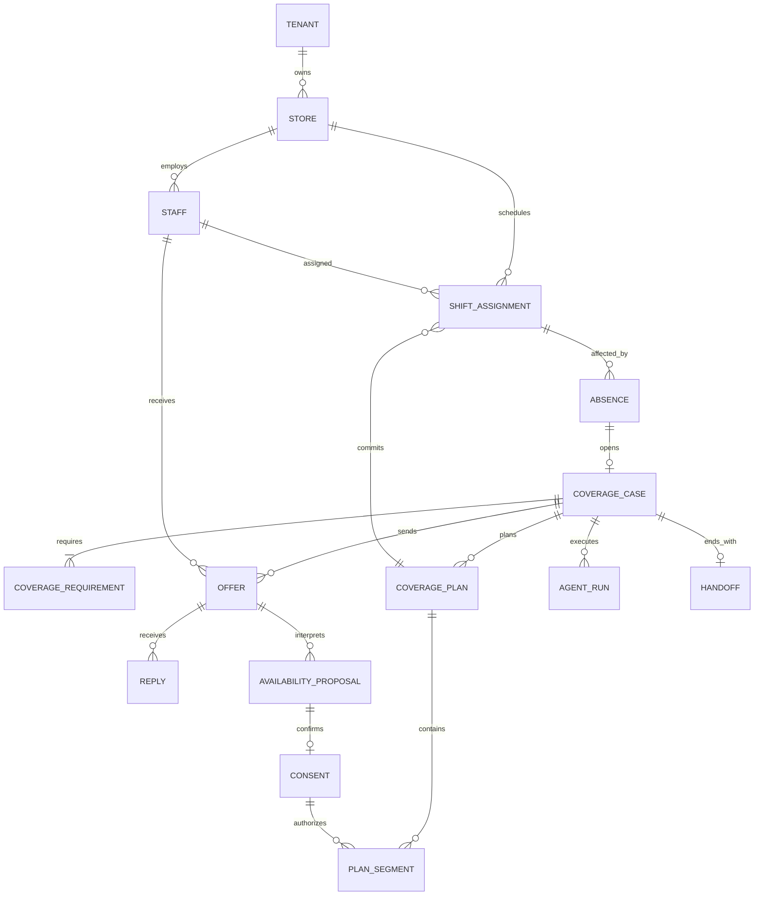
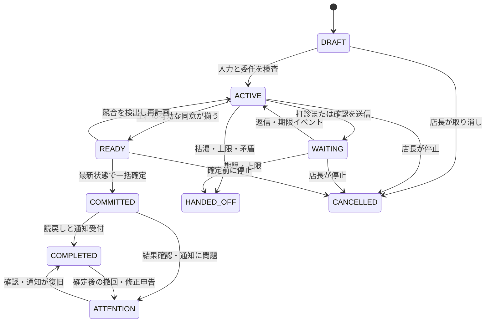

# RFC-002：ドメインモデルと業務ルール

> 2026-09-20適用注記：本書のクラス構成・順次打診・同意手段・選定規則は初期提案として保存します。現行モデルは[RFC-009](RFC-009-domain-v04.md)、対話と承諾は[RFC-011](RFC-011-outreach-and-state.md)を参照してください。旧版の人数・時間制限は未決事項で再確認します。

日付：2026-09-19／状態：実装ベースライン案  
関連：[時間と承諾のADR](../adr/ADR-005-consent-intervals.md)、[技術設計](RFC-003-implementation.md)

## 1. モデルの目的

不足する勤務枠に対して、本人が明示した条件を守りながら代替者を見つける。「可能という返信」「条件への同意」「シフト確定」「通知到達」を分ける。自然文は判断材料であり、データベース更新の命令にはしない。

## 2. 用語と境界

| 用語 | 定義 |
|---|---|
| Tenant | 契約・データ分離単位となる事業者。MVPは1件でも全業務データにIDを持つ |
| Store | 勤務・ルール・時刻表示の単位となる店舗 |
| Staff | その店舗で既に勤務するスタッフ。求職者ではない |
| ShiftAssignment | 既存または今回確定した勤務割当。給与・勤怠実績ではない |
| Absence | 既存割当の全部または一部で勤務できなくなった事実。理由は扱わない |
| CoverageCase | 一つの欠勤に対する不足枠を埋める案件 |
| CoverageRequirement | 店舗、職種、対象時間、必要人数からなる不足条件 |
| Offer | 一人への具体的な打診。初回打診と条件確認を区別する |
| Reply | チャネルから届いた相手の原文。事実と解釈を別に保持 |
| AvailabilityProposal | 返信から得た「この範囲なら可能」という未確定の候補 |
| Consent | 店舗・職種・日時・期限を明示した条件に対する認証済みの同意 |
| CoveragePlan | 同意済みの候補を組み合わせた全体案。シフトそのものではない |
| ScheduleRevision | 店舗シフトの変更版。最終更新時の競合検出に使う |
| PolicyVersion | 候補条件・連絡制限・実行上限の固定版 |
| Handoff | AIが完了できず、残り不足と証拠を人へ返す記録 |
| AgentRun | 案件内のAI実行・検査・費用の単位 |

境界は「勤務データ」「調整案件」「対話」「実行・計測」。課金、勤怠、給与、採用は別ドメインで、今回の集約へ混ぜない。

## 3. 関係図

MVPは1案件につき不足条件1つ。拡張先を示すため関係図では複数を許容するが、UI・APIでは1件に制限する。

## 4. 集約と主な属性

| 集約／エンティティ | 主な属性 | 更新規則 |
|---|---|---|
| Store | id, tenant_id, timezone, schedule_revision, active_policy_version | シフト操作と同じ取引でrevisionを増やす |
| Staff | id, store_id, display_alias, skills, contact_opt_in, active, contract_rule_ref | 本人・店長の許可経路のみ。AIは変更不可 |
| AvailabilityWindow | staff_id, start_at, end_at, source, version, valid_until | 申告済み可能時間。これだけでは確定同意にならない |
| ShiftAssignment | id, staff_id, role, start_at, end_at, status, source_case_id, consent_id | confirmedが重複不可。欠勤は別エンティティ |
| Absence | id, assignment_id, start_at, end_at, reported_by, created_at | 対象割当の範囲内。理由を持たない |
| CoverageCase | id, absence_id, state, version, requirement, deadline_at, policy_version, schedule_snapshot_revision, outcome_reason | 全コマンドに状態前提と版を要求 |
| Offer | id, case_id, staff_id, round, kind, terms_hash, expires_at, status | 初回打診は同一case/staffで一意 |
| Reply | id, offer_id, provider_event_id, raw_text_ref, occurred_at, received_at | 重複受信を防止。受信時刻と発生時刻を分離 |
| AvailabilityProposal | id, offer_id, role, start_at, end_at, evidence_spans, status | 解釈結果。条件変更時は新しい提案ID |
| Consent | id, proposal_id, staff_id, terms_hash, accepted_at, valid_until, revoked_at, channel_identity | 対象の全条件と本人を固定 |
| CoveragePlan | id, case_id, generation, schedule_revision, policy_version, plan_hash, status | staleになったら再作成。過去版を上書きしない |
| PlanSegment | plan_id, staff_id, start_at, end_at, role, consent_id | 同意と完全一致。勝手に切り詰めない |
| Handoff | case_id, reason_code, uncovered_intervals, completed_actions, next_options | 人が続けるための事実だけを格納 |

別途、InboxEvent、OutboxMessage、WorkerJob、ActionExecution、DecisionLog、ModelCall、BudgetReservationを実行基盤として持つ。DB上の設計はRFC-003に記載。

## 5. 時間モデル

- 時刻はUTCのtimestamp with time zone、表示はStore.timezone。MVPはAsia/Tokyo。
- 区間は半開区間 `[start,end)`。18〜19時と19〜22時は重複しない。
- 秒・ミリ秒は0、15分境界、start < end。MVP範囲外の分単位は確認を求め、勝手に丸めない。
- 同一の店舗営業日、最大4時間、必要人数1。日跨ぎ・長時間はMVPで拒否する。データ型は将来拡張可能にする。
- 複数の割当時間を単純加算して全体充足としない。対象区間の各境界を分割し、全区間で必要人数を満たすか検査する。
- 既存割当、承諾済み候補、確定済み割当を別々に扱う。未確定候補は確定充足分数へ計上しない。

例：必要 `[18:00,22:00)`。B `[19:00,22:00)` とC `[18:00,19:00)`なら4時間を埋める。B `[18:00,21:00)` とC `[20:00,21:00)`は合計4時間でも21〜22時が不足する。

## 6. 絶対に破ってはいけない条件

| ID | 不変条件 |
|---|---|
| INV-01 | 同じテナント・店舗に属する有効スタッフのみを操作する |
| INV-02 | スタッフのconfirmed割当は重複しない。DB制約とアプリ検査の両方を置く |
| INV-03 | 割当の店舗・職種・開始・終了は有効なConsentと完全一致する |
| INV-04 | Consentは当人が明示的に回答したものだけ。モデルや店長による代筆で作らない |
| INV-05 | 期限切れ、撤回、別版の同意を適用しない |
| INV-06 | 最新勤務情報、スキル、連絡許可、ルールを確定直前にも検査する |
| INV-07 | 同じ実行IDで同じ更新を二度行わない |
| INV-08 | 全時間充足する計画だけを一括確定する。部分確定はMVPで行わない |
| INV-09 | 完了はDB確定、読戻し一致、必要な模擬通知受付を満たす |
| INV-10 | 予算・回数・期限・停止フラグを越えて新規AI呼び出しや打診を開始しない |
| INV-11 | 不足元の欠勤を削除せず履歴として保持する。代替割当で欠勤者が出勤した扱いにしない |
| INV-12 | 辞退回数・健康状態・家庭事情を候補優先順位へ用いない |

INV-10でも、既に確定した結果の読戻し・通知・人への障害報告は止めない。LLMを使わない運用処理として完結させる。

## 7. 案件の状態遷移

COMMITTED以降の停止はCANCELLEDへ戻さない。確定した勤務の変更・撤回は別案件または人の修正操作とし、元の事実を残す。ACTIVE/WAITING等で技術障害が継続した場合はHANDED_OFFとしreason_code=TECHNICAL_FAILURE。成否不明の更新を抱えたまま未確定扱いにはしない。

ATTENTIONの理由が通知失敗なら通知復旧でCOMPLETEDへ進める。撤回・勤務条件の変更なら通知が通っただけで解消せず、人が修正処理を完了したことを記録して閉じる。

## 8. Offer・同意の状態

Offerは`QUEUED → SENT → ANSWERED / EXPIRED / CANCELLED`。送信受付と受信者による閲覧は別。生の「はい」は対象Offerを一意に確定できなければ曖昧扱い。

Proposalは`PROPOSED → AWAITING_CONSENT → CONSENTED / DECLINED / EXPIRED / REVOKED`。自由文の承諾意思はCONSENTEDへ直接進めず、整形した条件に対する構造化された同意操作を要求する。既に全条件を表示したOfferの専用同意ボタンなら1回で同意を記録できる。

デモでは1案件・1スタッフに有効なProposalは1件まで。変更提案は前のProposalをREVOKEDにして新規作成する。複数件の承諾を一つの「同意」に統合しない。

## 9. 候補抽出と公平な順序

ハード条件は在籍、対象店舗、スキル、申告可能時間、既存勤務との重複なし、設定された勤務・休憩条件、連絡許可、静かな時間帯、データ鮮度。欠勤者本人は代替候補から除外する。判断不能なら対象外とし、`RULE_DATA_MISSING`を残す。見つからない設定をAIに推測させない。

通過者の優先順は「不足をより長く埋められる」「最近の打診が少ない」「最後の打診から時間が経っている」「固定ID順」。候補の順はコードで安定させる。AIは順番を飛ばせず、同率の並びを都合よく変更できない。採用後の検証で偏りがあれば、この順位自体をADRで見直す。

辞退は減点せず、将来の候補除外にも使わない。希望時間帯や連絡拒否は本人の設定として尊重する。評価項目は「調整しやすい従業員ランキング」に転用しない。

## 10. コマンドとイベント

| コマンド | 前提 | 主なイベント |
|---|---|---|
| OpenCoverageCase | 欠勤が元勤務内、同じ欠勤の案件なし | CaseOpened |
| StartCoordination | 委任と設定が有効、DRAFT | CoordinationStarted |
| SendInitialOffer | 候補が有効、初回未打診 | OfferQueued / OfferAcceptedByChannel |
| RecordReply | 対象チャネル・スタッフ一致、未受信ID | ReplyRecorded |
| ProposeTerms | 解釈が検査済み、案件稼働中 | TermsProposed |
| AcceptTerms | 当人、条件ハッシュ一致、期限内 | ConsentRecorded |
| RevokeConsent | 当人、未確定 | ConsentRevoked |
| CommitCoveragePlan | 全不変条件が成立、最新の版 | PlanCommitted / AssignmentsCreated |
| VerifyCompletion | 読戻し・必要通知の受付済み | CaseCompleted |
| HandoffCase | 終了理由がある | CaseHandedOff |
| CancelCoordination | 店長、COMMITTED前 | CoordinationCancelled |

イベントは履歴・通知のために同じDB取引内で保存する。全面的なイベントソーシングは採用せず、現在状態テーブルを正本とする。イベントだけを後から再生して外部送信しない。

## 11. 境界ケースの扱い

- 欠勤者が復帰：確定前なら店長が停止。確定後なら既存割当を自動削除せず修正案件。
- 部分同意が先に集まる：条件付き候補として待機。全体不成立なら期限終了を通知し、勤務が決まったように表示しない。
- 同意後に別案件の勤務が入る：最新シフトを再検査し競合で拒否。MVPでは同時案件開始を制限するが、手動更新による競合は検査する。
- 返信が順不同：現在のOfferと期限、受信した条件版を確認する。時刻だけで最新の承諾と推定しない。
- チャネル上で送信取消：元本文を参照不能にし、未確定の解釈・同意を失効させる。既に確定済みなら人へ通知して修正経路へ。
- 勤務条件変更：新規PolicyVersionにし、旧版の計画をstaleにする。意味が変わる同意は再取得する。

## 12. サンプルデータ

営業日2026-09-20、Asia/Tokyo、店舗S、ホール、18〜22時。欠勤者X、候補A/B/C。Aは18〜22時可能だが今回辞退、Bは19〜22時、Cは18〜19時。同意期限は案件期限以内。デモルールに「最小追加勤務60分」を置くためCの1時間も許容する。これを実店舗や法令の一般的な勤務条件だとは扱わない。

## 13. 本番までに専門家と確認する境界

シフト変更の合意、契約ごとの勤務制約、休憩・時間外、未成年等の適用ルールは、店舗側で確認済みの設定を使う。モデルが法令を解釈して適用可否を決める構成にはしない。厚労省のシフト制留意事項を出発点に、実店舗の運用と照合する。[出典S06](../sources.md)

## 14. MVPの計画生成アルゴリズムと期限

候補計画は有効なConsentのみから作る。最大8人・1人1提案なので、最大256通りの部分集合を列挙できる。各区間は必要時間の内部にあり、全境界で被覆人数がちょうど1人のものだけを採用する。異なる人の区間が重複する余分な配置もMVPではしない。完全な計画が複数あれば、人数が少ない順、既定候補順位の辞書順で選ぶ。候補時間を切り詰めて成立させず、新条件が必要なら同意を取り直す。モデルはこの充足計算を代行しない。

初期の期限設定案は案件15分、初回返信待ち2分、条件確認待ち2分、自然文の再確認は1スタッフにつき最大1回。すべて案件期限以内へ制限する。案件期限は `min(開始時刻＋15分, 不足勤務の開始−5分)` とし、開始時点より後にならなければ自動調整を始めず緊急引き継ぎとする。ここで開始時刻は調整を開始した現在時刻である。これらは架空デモの方針で、実店舗の返信速度・最低連絡余裕を検証して変える。

Consentの有効期限は案件期限。本人に「全枠が揃うまで未確定、期限までに成立しなければ終了」と提示する。初回打診と条件確認を合わせ、同時に回答待ちにする相手は1人。既に同意済みの部分候補は保持し、次の未充足区間の候補へ進む。時間切れで次候補へ移った後の旧Offerは復活させない。
