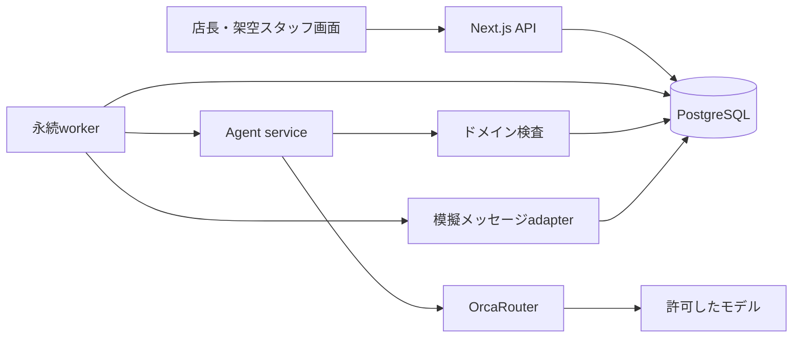

# RFC-003：アーキテクチャ・データ・API実装計画

> 2026-09-20適用注記：技術構成・18テーブル・APIは初期の実装候補であり、v0.4対応済みではありません。CSV原本と正式採用は[RFC-010](RFC-010-csv-authority.md)、改訂開発は[RFC-012](RFC-012-delivery-and-acceptance.md)を優先します。DB単独確定の保証を外部原本へそのまま移しません。

日付：2026-09-19／状態：実装ベースライン案／未実装  
関連：[構成ADR](../adr/ADR-003-stack.md)、[実行保証ADR](../adr/ADR-006-idempotency.md)

## 1. 技術構成

2人チーム、うち1人はフロントエンドに強いフルスタック経験者、もう1人はAPI・DB・アーキテクチャの経験があるが初学者に近い。言語の指定はないためTypeScriptを設計の既定とする。既存の得意言語を確認した結果、変更する場合はADR-003を更新する。

| 部分 | 採用案 | 理由 |
|---|---|---|
| UI/API | Next.js App Router、Node.js runtime、TypeScript | 1リポジトリで画面とAPI契約を共有する |
| 実行環境 | Node.js 24系、単一ホストでwebとworkerの2プロセス | リクエスト終了後にも期限処理・再開を継続する |
| DB | PostgreSQL 18系、pgによるSQL、番号付きSQL migration | トランザクション・排他制御を明示する。ORM学習を追加しない |
| 入力契約 | Zod等のスキーマ検証 | UIとサーバーの型を共有。ただし最終検査はサーバー |
| 非同期処理 | PostgreSQLのjobs・inbox・outbox、worker1個 | Redis・外部キューを増やさず状態を永続化 |
| モデル接続 | サーバー側のOrcaRouter adapter、HTTPクライアント | APIキーをUIへ渡さず、選択・計測を閉じ込める |
| UI更新 | 2秒間隔のGETポーリング | 4日間はWebSocket/SSEの接続管理を省く |
| テスト | Vitest、実PostgreSQLで統合テスト、Playwrightで主要UI | 時間・競合・再起動を含める |
| 開発起動 | Docker ComposeでDB、web/workerは同じ設定を使用 | ローカルPCをデモの既定にし、クラウド契約を依存にしない |

パッケージの厳密な版はDay 1に動作確認してlockfileへ固定し、Day 3以降は更新しない。公開資料で確認したAPIの考え方と、これから実装するコードを混同しない。[S07/S08](../sources.md)

## 2. 構成図



モデルからDBへ直接つながる経路は作らない。webは入力を記録してジョブを登録する。workerは案件状態から1ステップだけ処理し、WAITINGなら終了する。返信・期限・復旧イベントが次のジョブを起こす。

## 3. リポジトリ構成案

```text
src/app/                 店長画面・スタッフ役画面・Route Handlers
src/domain/              interval / policy / consent / coverage / state machine
src/application/         use cases / authorization / transaction orchestration
src/agent/               observation / interpretation / action selection
src/adapters/db/          pg repositories / migrations / transaction helper
src/adapters/orca/        inference / usage / routing capability
src/adapters/channel/     mock-inbox / future-line
src/worker/               main / jobs / outbox / deadlines / leases
src/contracts/            APIとモデルのschema、error codes
src/config/               runtime config / policy defaults
tests/unit/               純粋な業務規則
tests/integration/        実DB・プロセス障害・競合
tests/e2e/                主要画面・デモ初期化
fixtures/dev/             開発用6件
fixtures/eval/            評価用20件と追加境界ケース
docs/adr/ docs/rfc/       本設計を実装リポジトリへ移す
```

domainはDB・Next.js・モデルSDKをimportしない。テストのためClock、IdGenerator、ModelGateway、MessageChannelを差し替え可能にする。小さなモジュール分割にとどめ、マイクロサービス・汎用エージェント基盤・全面的イベントソーシングは作らない。

## 4. データベース仕様

業務レコードはUUID、tenant_id、created_atを持つ。外部入力のtenant_idは信用せず、認証コンテキストから取得する。関連するtenant/storeの組み合わせを複合FKまたは明示検査で守る。

| テーブル | 最低限の列・制約 |
|---|---|
| stores | tenant_id, timezone, schedule_revision, active_policy_version。更新時の排他の起点 |
| staff | store_id, alias, skills、連絡許可、active、availability・ルール参照 |
| staff_availability | staff_id, start_at, end_at, valid_until, version |
| policy_versions | store_id, version, config JSONB, created_by。immutable |
| assignments | staff_id, role, interval, status, source_case_id, consent_id、業務ID一意 |
| absences | assignment_id, interval, reporter_id。対象範囲内を検査 |
| coverage_cases | absence_id一意、state, version, deadline_at, policy_version, reason_code |
| offers | case_id, staff_id, kind, proposal JSONB, terms_hash, expires_at, status。初回打診の部分一意index |
| replies | provider_event_id一意、offer_id, staff_id, raw_text_ref, occurred_at, received_at |
| consents | offer_id, staff_id, terms_hash, accepted_at, valid_until, revoked_at、同じ提案への二重同意防止 |
| coverage_plans | case_id, generation, plan JSONB, hash, schedule_revision, status。case/generation一意 |
| execution_log | action_key一意、case_id, command, request_hash, result JSONB, status |
| inbox_events | channel/provider_event_id一意、payload_ref, status, received_at |
| outbox_messages | message_key一意、recipient_ref, template/payload, status, attempts, next_at, provider_receipt |
| jobs | dedupe_key一意、case_id, kind, due_at, state, lease_until, fence_token, attempts |
| model_calls | call_id一意、case_id, model, routing_source, usage, cost, status, prompt_version |
| budget_ledger | reservation_id一意、case_id, currency, reserved, actual, status |
| decision_events | case_id, event_type, event_version, actor_ref, evidence_refs, result_code, occurred_at |

MVPではRequirement、Proposal、PlanSegmentを案件・offers・plansの検証済みJSONBに格納してテーブル数を抑える。Conceptと物理テーブルを1対1にしない。コア検索条件・期限・状態・一意性はJSONBへ隠さず通常列に持つ。

条件確認用Offerは、初回Offerを参照する新しい行として作り、1つの不変なProposalを持たせる。条件変更時はその行の日時・hashを書換えず、前行を失効させて新しい条件確認Offerを作る。consents.offer_idはこの不変条件を指す。最初から全条件を表示して同意ボタンを押す場合も、そのOffer内のProposalを固定してからConsentを記録する。proposal_idはJSON内に保持し、plan内のconsent_idから対象条件を照合する。

主なindexは`jobs(state,due_at)`、`outbox_messages(status,next_at)`、`offers(case_id,status,expires_at)`、`assignments(staff_id,start_at)`、`decision_events(case_id,occurred_at)`。ログや本文にAPIキーを格納しない。

### 重複勤務をDBでも拒否するSQLの設計例

```sql
CREATE EXTENSION IF NOT EXISTS btree_gist;
ALTER TABLE assignments
  ADD CONSTRAINT valid_interval CHECK (start_at < end_at);
ALTER TABLE assignments
  ADD CONSTRAINT no_overlapping_confirmed_assignment
  EXCLUDE USING gist (
    tenant_id WITH =,
    staff_id WITH =,
    tstzrange(start_at, end_at, '[)') WITH &&
  ) WHERE (status = 'CONFIRMED');
```

これは実行済みmigrationではなく設計例。拡張の利用可否を確認し、実際の型名・NULL制約・複合FKと併せて実装する。DBのrangeとexclusion constraintは公式仕様を参照。[S07](../sources.md)

## 5. シフト確定トランザクション

確定処理は経験者が担当する。外部API呼び出しやモデル待ちをDBロック中に行わない。

1. `BEGIN`。対象storeの行、案件行、必要なstaff/consent行の順で`FOR UPDATE`する。同種の複数行はID順。tenantは認証コンテキストと各所属で検査する。
2. `action_key`が既に成功していれば保存済み結果を返す。同じキーで異なるrequest_hashは409。
3. state=READY、expected_case_version、deadline、停止フラグ、最新policy・schedule_revisionを確認する。
4. 各staff・Consentをロックして、役割、完全一致する時間、本人、同意期限、撤回、既存割当、勤務制約、全体充足を再検査する。
5. 競合があればrollback。更新は0件。案件へ競合イベントを別の取引で記録し、回数上限内で再計画する。
6. 全割当、plan=COMMITTED、case=COMMITTED、revision増分、execution_log成功、通知用outboxを同じ取引で書いてcommitする。
7. ロック外で割当を読戻す。必要な模擬通知がチャネルに受理されればCOMPLETEDへ進める。

元の欠勤割当はAbsenceとともに保持し、代替者の追加割当を作る。確認後の全件INSERTが失敗すればすべてrollback。通知だけに失敗しても確定済み勤務は取り消さない。

全シフト・スタッフ条件・同意の変更経路が同じロック順を守ることを実装規約にする。ロックだけで安全とせず、DB制約で重複も拒否する。DB管理画面からの直接編集はデモ中も禁止し、変更APIを通す。

## 6. ジョブと送信の保証

`FOR UPDATE SKIP LOCKED`でdue jobを取得し、30秒のleaseと単調増加fence_tokenを割り当てる。モデル呼び出しの上限20秒より長くする。ネットワーク中にlease更新が必要ならheartbeatする。結果適用時はfence_tokenとcase_versionを再検査し、古いworkerの結果を適用しない。

プロセス停止後はlease切れを再取得する。外部呼び出しを自動的に再実行してよいとは限らない。model_call=RUNNINGで成否不明なら費用予約を残し、UNKNOWNとして扱う。DB更新はexecution_logを照会して結果を再利用する。

outboxは状態更新と同じDB取引で作る。送信は少なくとも1回の試行であり、外部到達の完全な1回性は保証しない。模擬チャネルはmessage_keyを一意にし、同じ内容の送信を重複させない。将来のLINEでは対応APIに初回から同一retry keyを付けるが、受付と配信は区別する。[S04](../sources.md)

タイムアウトは`due_at`を持つジョブとして保存する。長時間のsleepやHTTP処理後のメモリ内タイマーに依存しない。終端状態のジョブは無処理で完了させる。待ち時間を短縮するデモ用Clockはモデル呼び出しの実レイテンシや費用計測時計から分ける。

## 7. API契約

JSON、日時はISO 8601 offset必須、エラーは`{code,message,requestId,details}`。更新はIdempotency-KeyとexpectedVersionを使う。認証からtenant/actor/storeを決める。bodyで任意のactor_idを渡せない。

| Method / Path | 用途 | 主な条件 |
|---|---|---|
| GET /api/store | 店舗・ルール・利用可能な案件 | 担当店舗のみ |
| GET /api/schedule?date= | 現在シフト・版 | 店長は店舗全体、スタッフは本人分のみ |
| POST /api/cases | 欠勤・案件作成 | assignmentId、start、end、expectedScheduleRevision |
| POST /api/cases/:id/start | 実行委任 | 店長、DRAFT、expectedVersion |
| GET /api/cases/:id | 状態・不足・候補・終了理由 | 権限に応じて情報を制限 |
| GET /api/cases/:id/events?cursor= | 進行・検証ログ | カーソルで差分取得 |
| POST /api/cases/:id/cancel | 確定前の停止 | COMMITTED以降は409と修正導線 |
| GET /api/me/offers | 当人の打診と確認 | 他スタッフを取得不可 |
| POST /api/offers/:id/replies | 自然文・辞退・時間提案 | 当人、長さ2000文字以下、期限内 |
| POST /api/offers/:id/consents | 条件への明示同意 | termsHash、当人、未失効 |
| POST /api/consents/:id/revoke | 確定前の撤回 | 当人、COMMITTEDならATTENTION用の申告 |
| POST /api/admin/schedule-change | テスト用の競合を起こす | 店長、版検査、デモ限定 |
| GET /api/metrics | 費用・結果の集計 | 店長／運営者 |
| POST /api/demo/reset | シナリオ初期化 | loopback、demo flag、デモ管理セッション |

内部の`commitPlan`や`sendOffer`はサービス関数として扱い、公開の万能ツールAPIにしない。将来の`POST /api/webhooks/line`は本番チャネル導入時のみ追加し、raw body署名検証・永続inbox登録後に2xxを返す。[S03](../sources.md)

例：自然文返信

```json
{"text":"19時からなら可能です","clientEventId":"uuid","expectedOfferVersion":1}
```

返却は`202 {eventId, processingState:"QUEUED"}`。この時点で勤務確定と表示しない。`POST /consents`は`{termsHash:"sha256...",decision:"ACCEPT",expectedOfferVersion:1}`を受け、当人の同意を保存する。自由文のtextだけでCONSENTEDにはしない。版番号は対象資源ごとに指定し、offersにもversion列を持たせる。

## 8. エラーコード

`INVALID_INTERVAL`、`OUT_OF_MVP_SCOPE`、`FORBIDDEN`、`STALE_VERSION`、`OFFER_EXPIRED`、`CONSENT_MISMATCH`、`ALREADY_COMMITTED`、`NO_ELIGIBLE_CANDIDATE`、`RULE_DATA_MISSING`、`MODEL_INVALID_OUTPUT`、`MODEL_UNAVAILABLE`、`BUDGET_LIMIT`、`DEADLINE_REACHED`、`ACTION_RESULT_UNKNOWN`、`NOTIFICATION_FAILED`。

400は入力、401/403は認証・権限、409は版・状態、422は業務制約、429は実行上限、503は依存先障害。曖昧な200応答に失敗を隠さない。

## 9. 起動・配布・変更管理

`.env.example`に名前だけを置き、キーはローカルの除外ファイルか配布先のsecretへ設定。`ORCA_BASE_URL`、`ORCA_API_KEY`、許可モデルID、`DATABASE_URL`、`DEMO_MODE`、`SESSION_SECRET`、総予算設定を必須として検証する。SDK・HTTPクライアントの暗黙retryは無効にしてworker側に集約する。

開発機でDB migration・seed・web・workerを起動し、healthはweb、worker heartbeat、DB、設定状態を返す。外部AIに毎回pingするhealth checkは作らない。提出時はlockfile、schema、seed、実行手順、設定例、評価結果を同梱し、秘密値は同梱しない。

ローカルでは127.0.0.1へbindする。外部公開を行う場合は認証とdemo reset制限を追加し、ローカル限定の役切替を公開しない。serverlessの短命リクエスト内でworkerを起動しない。

## 10. 選択肢と採用しなかった理由

SQLiteは初期起動が簡単だが、今回は競合の検証をPostgreSQLと同じ挙動で行いたい。Supabase等の管理DBは選択肢だが、アカウント作成・ネットワーク制限をMVPの依存にしない。Redisキュー、Temporal、LangGraph等は価値が出る規模なら後で検討し、4日間は永続状態機械を小さく実装する。AIエージェントを複数体に分けない。
