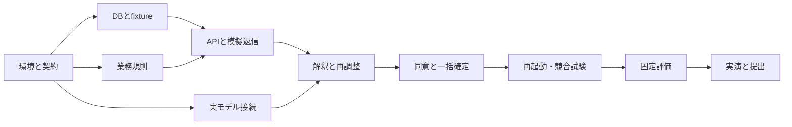

# RFC-005：2人・4日間の開発計画と実装バックログ

> 2026-09-20適用注記：本書は初期38人時見積りの履歴です。CSV原本・同時対話を含む最新の担当・日程・仮見積りは[RFC-012](RFC-012-delivery-and-acceptance.md)を参照してください。

日付：2026-09-19／状態：実装ベースライン案  
関連：[スコープ](RFC-001-product.md)、[技術設計](RFC-003-implementation.md)、[検証](RFC-008-evaluation.md)、[体制ADR](../adr/ADR-010-delivery.md)

## 1. 体制と見積りの前提

Aはフロントエンドに強いフルスタック経験者。BはAPI・DB・アーキテクチャの経験があるが初学者に近い。Aが確定処理・AI連携・全体結合を所有し、Bは仕様が閉じた入力検証、データ、テストを所有する。Bに基盤全体の設計を単独で委ねない。

1人1日6時間の実作業を仮定し、計48人時。これは確約された稼働時間ではない。開発38人時、余裕10人時を置く。内訳はAが21人時＋余裕3人時、Bが17人時＋余裕7人時。Aの余裕をBの余裕でそのまま代替できない点が最大のリスク。Day 1午前で得意言語・環境構築速度・実際の稼働を確認し再見積りする。

本計画は小さな永続ワークフローを短期間で構築できるという仮説を含む。未経験の技術が多い場合、全項目を48人時で達成できるとは断定しない。

## 2. 日別の到達点

| 日 | Aの主担当 | Bの主担当 | 日末の実物と合格条件 |
|---|---|---|---|
| Day 1 | 共通型・起動、最小画面、OrcaRouter実接続、1本のAPI→DB経路 | fixture、migration下書き、時間検証、API正常・異常入力 | 実モデルのJSON応答と費用取得可否が分かる。欠勤登録・再読込が動く |
| Day 2 | 条件提示・同意UI、agent loop、確定トランザクション | 模擬受信箱、条件検査、API・DBテスト | 辞退→部分提案→本人同意→組合せ→一括確定が通る |
| Day 3 | 再起動・競合・停止・通知不明の修正、結合 | 障害注入、評価fixture、費用集計・結果表 | 危険操作の試験が通る。20評価ケースの初回結果がある |
| Day 4 | 不具合修正、実演、説明資料・提出確認 | 再現手順、最終評価、録画・初期化確認 | 固定版で実演3回、結果ファイル、起動手順、提出物が揃う |

毎朝15分で「今日の完成条件・依存・削る候補」を共有。毎日中間と終了時にAがBの変更をレビューする。20分以上停止した環境・設計問題はペア作業に切り替える。Day 3終了で新機能追加を凍結する。

## 3. バックログと受入条件

時間は実作業の初期見積り。レビュー・短いペア作業を担当時間に含む。T番号を実装時のIssue名に引き継ぐ。

| ID | 作業 | A時間 | B時間 | 依存 | 完了条件 |
|---|---|---:|---:|---|---|
| T01 | 起動・共通型・役割・設定検証 | 1 | 1 | なし | 両PCで起動、秘密値なしの設定例、CIの型検査 |
| T02 | DB migration・seed・reset | 0.5 | 2.5 | T01 | 空DBから再構築、架空8人以内、reset制限 |
| T03 | 区間・候補・同意・充足の純粋関数 | 1 | 2 | T01 | 隙間、重複、未同意を拒否。欠勤者除外 |
| T04 | 店長・スタッフ・進行の最低限UI | 3.5 | 0.5 | T01 | 画面遷移、条件表示、状態の違いが読める |
| T05 | API・認証コンテキスト・版検査 | 1 | 2 | T02,T03 | 他人の同意不可、更新重複を拒否／再利用 |
| T06 | 模擬送受信adapter・返信保存 | 1 | 1 | T05 | 同じイベントは1回記録、返信後に処理再開 |
| T07 | Orca adapter・schema・usage・予算予約 | 3 | 0 | T01 | 実接続、未取得表示、予約込み上限判定 |
| T08 | 有限のagent loop・再確認・再計画 | 3 | 0 | T03,T06,T07 | 返信に応じて行動が変化し、上限で停止 |
| T09 | 原子的確定・読戻し・通知outbox | 2 | 0 | T02,T03,T05 | 全成功または全rollback、二重確定なし |
| T10 | DB worker・lease・期限・再開 | 1 | 1 | T02,T06 | 再起動後に再開、古い結果を適用しない |
| T11 | 停止・失効・撤回・通知失敗 | 1 | 1 | T08,T09,T10 | 終了理由、残り時間、確定済み事実を保持 |
| T12 | 結合・競合・主要E2E | 1 | 3 | T04〜T11 | RFC-008の必須事故ケースを検出 |
| T13 | 固定評価・ルート比較・費用記録 | 1 | 1 | T12 | 分母・失敗分費用・未計測を明記 |
| T14 | 計測表示・結果の書き出し | 0 | 1 | T07,T13 | 実測／推定／不明を別表示 |
| T15 | 初期化・録画・実演・起動文書 | 1 | 1 | T12,T13 | 同じ初期状態から3回再現 |
| **計** | | **21** | **17** | | **38人時＋余裕10人時** |

T07はDay 1に小さな接続確認を先行し、完成はT08前。T09/T10は統合しながら進める。T13の2人時は評価の能動作業で、API待ち時間を含む経過時間ではない。18テーブルは単一migrationにまとめ、汎用repositoryや管理CRUDを全テーブル分作らない。

## 4. 実装の依存順序

最初からすべてのUIを仕上げず、1件の欠勤をDBに保存し、1件の返信を処理できる細い経路を作る。型、ID、状態、エラーコード、schemaの変更は当日中に両担当へ共有する。

## 5. 範囲を削る判断

| 時点・状況 | 対応 | 残すもの |
|---|---|---|
| Day 1昼にOrca接続不可 | 接続情報・対応仕様を確認し、契約が同じfake adapterで独立部分を進める | 実推論の検証は未達と明記。必須サービス利用達成と偽らない |
| Day 1末に環境・登録が未完 | グラフ、装飾、複雑なデータ編集UIを削る | seed固定、基本画面、DB永続化 |
| Day 2末に主要ループが未完 | 自然文対応を「辞退／開始時刻変更／曖昧」の3種に絞る | 構造化した本人同意、部分枠組合せ、一括確定 |
| Day 3に比較時間不足 | 比較の反復回数を減らし、サンプル数を公表 | 安全性・競合・再起動の必須試験 |
| 最終日に実接続障害 | 保存済みの実測ログと事前録画を再生として表示 | ライブ推論と再生の明確な区別 |

期限・予算・本人同意・認可・原子的確定は削らない。これらが未完成なら「安全な自動確定まで実装済み」とは説明しない。汎用チャットUI、LINE本番、複数店舗、課金、発注、天候予測を追加しない。

## 6. レビュー・マージ・リリース手順

小さい変更単位で型検査と対象テストを通す。Bの入力検証・migration・APIはAがレビュー。Aの確定処理はBが仕様の観点で読み、競合テストを独立して作る。実装をそのまま写す期待値にせず、不変条件から期待結果を決める。

最終版にはcommit ID、fixture版、prompt版、Router設定版、日時、環境、結果を紐づける。接続キーを含む画面・ログ・録画を提出しない。提出先・提出時刻・発表時間は未確認なのでDay 1に主催者情報と照合する。

## 7. 残リスクと責任

| リスク | 早期兆候 | 対応・担当 |
|---|---|---|
| Aへの集中 | Bのレビュー待ちが半日を超える | Aが1回30分の固定レビュー枠。Bはfixture・試験へ進む |
| ドメイン経験不足 | 法令・就業規則を想像で埋め始める | 全員。デモルールと実店舗ルールを明示し実運用延期 |
| 永続workerの実装過大 | lease・再試行の状態が説明不能 | A。単一workerを維持し遷移表と試験で制限 |
| 実費不明 | usageやresolved modelが欠落 | A。UNKNOWN表示、上限検証、未知の多段経路を無効化 |
| 業務価値の未検証 | デモ好評だけで有料化判断 | Bを窓口に、ハッカソン後の顧客検証へ記録を引き継ぐ |

この計画自体は着手・完了実績ではない。実装開始後に各Tの見積り・実績・未達理由を追記する。
