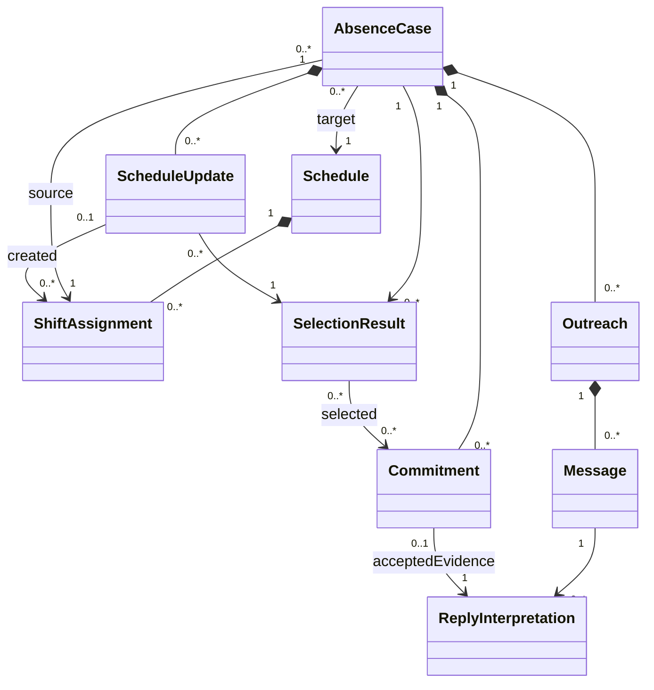

# RFC-009：Taskcalのv0.4に基づくドメインモデルの改訂

作成：2026-09-20／状態：現行設計方針＋レビュー反映案、実装未検証  
適用：RFC-001/002/003の対象領域を改訂。詳細な新旧対応は[変更記録](../CHANGELOG.md)。  
原資料：[v0.4](../references/proposal-05-data-model-v0.4.md)／判断：[ADR-012](../adr/ADR-012-domain-aggregates.md)

サービス名は[ADR-020](../adr/ADR-020-taskcal-name.md)によりTaskcal。名称の変更は以下の設計状態を変更しない。

## 1. 目的と情報の確度

欠勤調整に必要な概念と整合性を定義する。v0.4に書かれた方針は「現行文書の方針」として記録し、今回のレビュー提案を全てチームが個別承認したとは扱わない。必要な選択が残る箇所は[未決事項](../OPEN-QUESTIONS.md)へ集約する。

ユーザー確認済みの条件は案05採用、2人・4日、現場の専門家と協力先なし。1人はフロントエンドに強いフルスタック経験者、もう1人はAPI・DB等の経験があるが初学者に近い。言語・実稼働・費用予算は未確認。

## 2. 現行の範囲

架空1店舗、同時1案件、必要勤務枠1つ、役割1種類、必要人数1。適格者全員へ個別に同時打診し、自然文から一意に決まる勤務意思と条件を承諾候補にする。訂正・撤回は確定前なら再計画、確定後なら人へ引き継ぐ。

勤務の入出力はCSV、連絡はテスト用受信箱、推論はOrcaRouterを使う。SaaS・LINEは将来の接続先。需要予測、発注、給与、実店舗運用は対象外。

旧案の「最大8人・15分単位・最大4時間・日跨ぎなし」は実装を小さくする提案で、v0.4に確定事項として再記載されていない。現在は未決事項の初期推奨値として扱う。順次打診と全件の専用同意ボタンは現行の必須要件にしない。

## 3. 集約と責任

| 集約／情報 | 現行方針 | レビューから補う契約 |
|---|---|---|
| Store | 店舗・timezone・固定RoleCode | 店舗と営業日の定義を一貫させる |
| Staff | 在籍、役割、可能時間、月次上限、ContactEndpoint | 設定変更時に選定の前提を再検査。勤務データとの照合は集約をまたぐ |
| Schedule | 1店舗・1営業日の勤務表、内部版・外部参照 | 正式採用されたCSV版と一致した現在状態を持つ |
| ShiftAssignment | Schedule内の通常／代替勤務 | 安定した勤務ID、元案件との関連、入出力の往復性 |
| AbsenceCase | 欠勤、対話、承諾、選定、更新・終了 | 1案件で正式採用する勤務集合は一つ。訂正受信と確定の順序を守る |
| Outreach | 案件内の相手別対話 | 一人の確認中を案件全体の待ちにしない |
| Commitment | 版付きの承諾 | 旧内容は固定、status変更と訂正履歴を区別。保留中は選定不可 |
| ScheduleUpdate | 選定を勤務表へ反映する操作 | 出力作成と正式採用を区別し、成否不明を保持する |
| SelectionResult | 不変の選定結果 | 選んだ承諾のID・版と規則版、検査時の入力版を特定 |
| Message／ReplyInterpretation | 不変の原文／版付き解釈 | 受信順と処理完了順を分離、採用解釈を追跡 |
| ProcessingEvent | 追記履歴 | 現在状態の正本ではない。操作・検査・失敗の証拠 |
| CaseOutcome | 案件の終了結果 | 完了後の申告で以前の確定事実を消さない |

CandidateEvaluationは計算結果。RoleCode、TimeRange、CoverageRequirement等は値。概念ごとにテーブルを作る必要はない。ScheduleとCaseを別集約にしたことは、両者の更新を別々に成功させてよいという意味ではない。

## 4. 最新の証拠経路

これは主要関連の改訂案で、属性の全一覧はv0.4原資料を参照。SelectionResultを承諾0件の評価にも残すなら0..*とし、成功した選定だけなら1..*としてよい。正式採用は案件あたり最大1件。通常勤務は生成元ScheduleUpdateを持たない。

`commitmentId → shiftAssignmentId`の対応はScheduleUpdateの結果へ残せばよく、旧CoveragePlanItemを必ず復活させる必要はない。

## 5. 時間と月次計算

TimeRangeは半開区間 `[start,end)`、start < end。表示と月境界はStore.timezoneに従う。可能時間から既存勤務を差し引いた結果は区間集合になり得る。独立した複数の可能時間窓は、Outreach.offeredTimeがいずれか1つの窓に完全に収まるなら許可する。1つの窓が既存勤務の差し引きで分断される場合は、Outreach.offeredTimeを単一のままにするため範囲外として明示的に拒否する（Q03）。中間の勤務済み時間を埋めた一つの区間へ戻さない。

勤務の正本は正式採用されたCSVの勤務集合で、Scheduleはその共通表現。通常・代替を同じShiftAssignmentとして集計し、ScheduleUpdateから二重加算しない。

月次上限を月全体の割当総量とする推奨案では、完了済みも含む予定区間を数え、取消と欠勤区間を除く。勤務状態がcompletedになっただけで枠を復活させない。勤怠実績はMVPで取得していないため、実労働時間の上限判定と称さない（Q06）。

部分欠勤を扱うなら、元勤務18〜22時・欠勤20〜22時では18〜20時を残す。全時間欠勤だけに制限する選択でもよい（Q04）。月跨ぎ・日跨ぎを対応範囲に含めるなら、営業日の異なるScheduleや月境界で実時間を検査する。日跨ぎの扱いはQ05で確定する。

取得できていない勤務を0とみなさない。月次を検査するなら、対象月の全入力または「他日は空」の完全なデモfixtureが必要。データの完全性・版・取得範囲は[RFC-010](RFC-010-csv-authority.md)へ渡す。

## 6. 選定の成立条件

現在の文書では過剰配置を許すかが未決（Q02）。必要人数1を「常時ちょうど1人」とするか、「最低1人」とするかを選ぶ。

| 入力 | ちょうど1人 | 最低1人・超過許容 |
|---|---|---|
| B18〜20、C19〜22 | 19〜20が2人なので不成立 | 5人時の計画として成立し得る |
| B18〜19、C19〜22 | 成立 | 成立 |

いずれでも、承諾時間を自動で短縮しない。実行可能な計画だけを選定し、その後に勤務時間合計・人数・承諾が揃った順・安定ID順を用いる。超過禁止なら完全充足計画の時間合計は同率となるため、第1優先は実質的に効かない。

「有効な承諾すべての和集合で覆われる」と「同時に採用できる合法な勤務集合がある」は別。fullyCoveredと実行可能性を同じbooleanへ曖昧に詰め込まない。

## 7. レビュー反映案の不変条件

| ID | 条件 |
|---|---|
| D01 | 欠勤区間は元勤務内。同店舗・役割の必要枠を作り、欠勤者本人は代替候補から除く |
| D02 | 同じ欠勤区間について稼働中の重複案件を作らない |
| D03 | 同意の相手、案件、日時、役割は打診・選定・確定で一致する |
| D04 | 選定できる承諾は最新の有効版。確認中、期限切れ、撤回、未処理変更ありのものを確定しない |
| D05 | 一案件で正式採用する計画は一つ。別操作キーでも二重採用を許さない |
| D06 | 計画内の全割当は一括採用。片方だけ正式勤務として残さない |
| D07 | 同じ操作IDで異なる内容は拒否。同一内容は保存済み結果を照合する |
| D08 | 月次・重複を検査した前提が変更されたら再検査する。対象日の版だけで全前提を代表させない |
| D09 | 確定済みと未確認を区別。読戻し・通知失敗で勤務を未確定へ戻さない |
| D10 | 停止成立後に新規打診・正式採用をしない。確定済みの取消は別の変更操作 |
| D11 | 読込・再起動・次案件が同じ正式版を参照する |
| D12 | 条件不足、予算・回数・期限に達した際は新規実行を止め、事実を保持して引き継ぐ |

「不変条件」は実装の必須受入条件として提案するもの。Q02等の未決値を決定した事実は意味しない。

## 8. 物理設計への引渡し

v0.4のクラスをそのままテーブル化しない。集約内の値・不変スナップショット・実行履歴を分類して保存形式を決める。勤務ID、staffId、案件ID、操作ID、採用解釈、更新後CSV参照は欠落させない。

旧RFC-003のDB製品・18テーブル・API一覧は実装候補であり、v0.4対応済みのDDLではない。現行構造に合わせたmigration/APIは次段階で設計する。網羅的な法令実装やSaaSごとの仕様をここへ追加しない。
