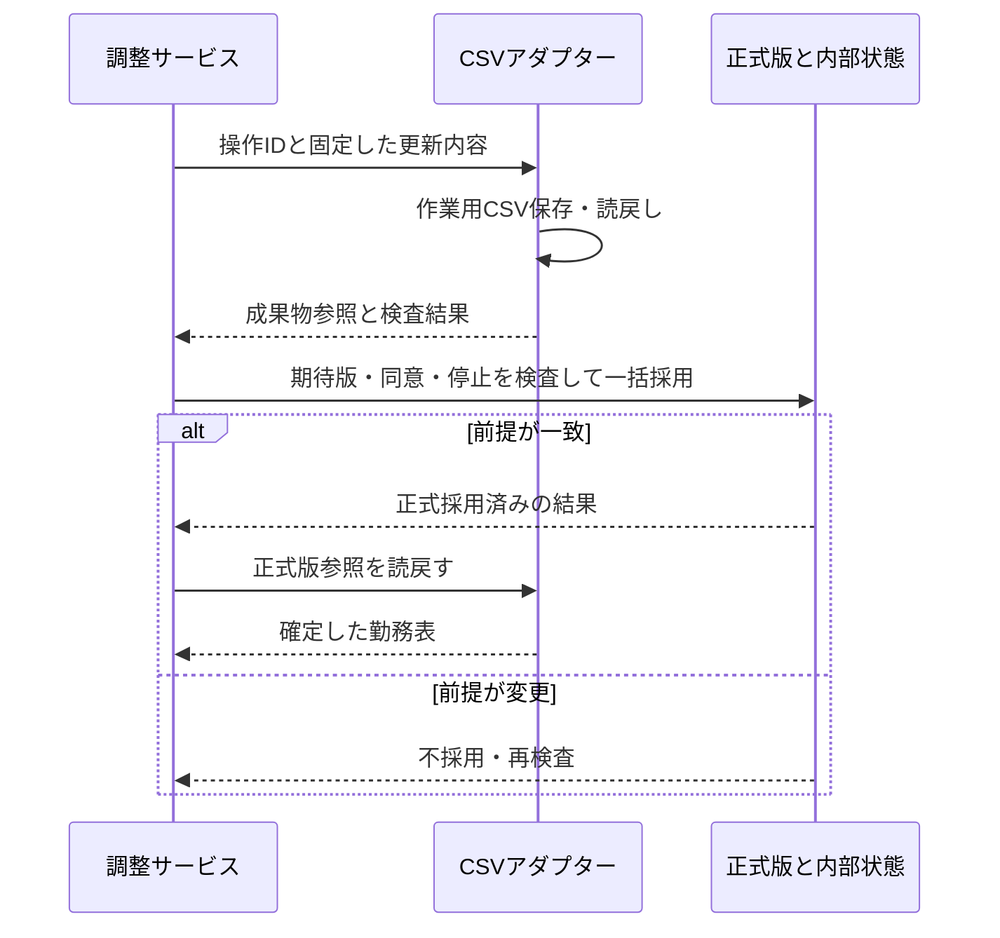

# RFC-010：CSV原本・正式採用・連携Gatewayの契約

作成：2026-09-20／状態：CSV利用は現行方針、正式採用方式はレビュー反映案  
関連：[ADR-015](../adr/ADR-015-csv-source.md)、[ADR-016](../adr/ADR-016-csv-adoption.md)、[ADR-019](../adr/ADR-019-gateway-contract.md)

## 1. 目的

元CSVを保持しつつ更新版を出力し、どの勤務表が正式か、どこへ反映したか、再起動時に何を読むかを特定する。CSV出力を実店舗の外部シフトサービスへの反映と同一視しない。

v0.4はCSV利用を定めたが、更新版が正式版になるかは定めていない。Q01に対して、本RFCは「アプリが管理するデモ勤務表の正式版へ採用する」方式Aを推奨する。変更案を出力するだけの方式Bを選ぶなら、成果は出力完了であり勤務確定ではない。

## 2. 原本と内部状態

| 情報 | 意味 |
|---|---|
| 入力CSV | 初回取込みの資料。変更前を残す |
| 管理版CSV | 不変のIDと内容に結び付く勤務表の版 |
| 正式版参照 | 現在有効な管理版を指す小さなメタデータ |
| Schedule | 正式版から作った共通勤務表。外部内容の意味を保持 |
| ScheduleUpdate | 一つの選定結果を適用する操作と、その結果・照会状態 |
| 作業用出力 | 作成・読戻し検査中のCSV。正式勤務として数えない |

方式Aでは、全ての照会・再起動・次案件は正式版参照から始める。古い入力パスを固定して使い続けない。利用者が外で元CSVを変更した場合は、新しい管理版として取込み直す。管理下の不変版を直接編集しない前提をデモ運用にも明示する。

## 3. IDと版

- scheduleIdは店舗・営業日に対応する内部ID。versionは内部の意味ある変更で進める。
- sourceRevisionは外部版・内容hash・不変な管理版IDのいずれか。任意の取込番号だけでは内容の変更を検出できない。
- 同じ内容を読むたびに無意味にversionを進めない。内容が同じかの正規化規則を定義する。
- CSVへ安定した勤務IDを含める。ない入力を受けるなら初回にID付きの正規化版を作り、その後は同じIDを往復させる。
- 行番号・表示名・勤務内容のhashだけを勤務の恒久IDにしない。並べ替え・改名・時間変更と別勤務の作成を区別する。
- 操作IDとrequestHashを固定する。追加勤務IDは再試行で作り直さない。

具体的なCSV列名は後続設計でよい。staffId・勤務ID・役割・時刻・状態・必要な由来を読戻しで再現できることは必須とする。

## 4. 正式採用の手順案

1. 案件の最新の承諾・停止・期限を確認し、選定結果と更新内容を固定して操作を記録する。
2. 正式版参照、内部版、勤務・スタッフ条件、月次入力の完全性を取得する。
3. 固定した操作内容から作業用CSVを生成する。元ファイルは上書きしない。
4. 書込み完了した成果物を読み戻し、期待する勤務ID・担当者・役割・区間・件数を検査する。
5. 正式採用直前に案件版、参照した入力版、同意・未処理変更・停止・期限を再検査する。
6. 内部の一つの取引で、正式版参照、対応する内部勤務表、採用済み計画、案件の確定事実、操作結果、必要な通知待ちを揃えて保存する。
7. 正式版を再取得して整合を確認し、模擬通知を処理する。業務完了の境界はQ07で固定する。

ファイルシステムとDBを一つの通常のDB取引にできるとは仮定しない。ファイルを先に完全保存・検査し、内部の正式採用を後に置く。5で失敗した成果物は未採用として保持・整理し、勤務照会に混ぜない。

保存前のファイルが利用者に正式版として配布されないよう、作業用領域と公開される正式参照を分ける。ディスク障害等で正式採用後のファイルが失われた場合は照合不能として停止し、旧版へ黙って戻さない。

## 5. 競合と月次前提

直前のhash比較だけでは、その後に起きる変更を防げない。MVPの方式Aでは正式版参照を期待版付きで切り替える共通経路を設け、勤務変更・スタッフ設定変更・訂正受信・案件停止も整合する排他規則を使う。

1店舗なので店舗単位の直列化でもよい。外部API待ちやCSV生成中に長いDB取引を保持せず、生成後の正式採用で再検査する。別操作が同じ旧版から作ったCSVは両方を正式版へ採用しない。

月次検査は対象日のScheduleだけでは成立しない。対象月の入力範囲、完全性、参照版を管理する。MVPは対象月の架空入力を不変に固定する案が小さい。欠けた日を0と推定しない。日跨ぎを許すなら隣接営業日の実時間も検査し、月跨ぎは店舗timezoneで分割する。

## 6. Gatewayの論理契約案

| 操作 | 入力 | 出力・重要な区別 |
|---|---|---|
| loadSchedule | 取得対象の参照 | 勤務内容、取得版、対象範囲・取得可否 |
| applyUpdate | operationId、requestHash、期待版、固定された勤務内容 | 出力準備済み／反映済み／未反映／競合／成否不明／一部反映／出力のみ |
| getUpdateResult | operationIdと接続範囲 | 保存済みの結果、または照合継続が必要という状態 |
| readBack | 更新結果が指す成果物・版 | 実際の内容と読取った版 |

UpdateResultは更新後参照、更新後版、`commitmentId → internalShiftId → externalAssignmentId`の取得できた対応、結果種別を持つ。成否不明の項目を空の成功結果で返さない。

CSVのapplyUpdateが返すPREPAREDは「検査済みの作業用CSVができた」であり、正式採用済みではない。adapterの操作照会は成果物の状態を返し、アプリケーションサービスがScheduleUpdateと正式版参照を照合してADOPTEDを判定する。将来のSaaSが返すAPPLIEDは外部反映の事実で、内部状態の同期や通知まで完了した意味ではない。EXPORTED_ONLYは正式採用を行わない出力専用モードを示す。

adapterへ渡すコマンドに必要な勤務内容を含める。adapterが案件・選定・同意の保存先を自由にたどって実行内容を組み立てる構成を避け、ドメイン側が検査済み内容を渡す。

## 7. 状態と障害の対応

| 地点 | 正式勤務か | 復旧 |
|---|---|---|
| CSV生成前の停止 | いいえ | 同じ操作の未実行を確認して再検査 |
| CSV保存後・正式採用前の停止 | いいえ | 操作IDで成果物を照合し、前提を再検査して採用または破棄 |
| 正式採用直後の応答喪失 | はい／呼出し元からは不明 | 内部の操作結果と正式参照を照合。再作成しない |
| 正式版読戻し不一致 | 確定事実を保持 | 要対応。旧版や未確定へ自動復帰しない |
| 通知失敗 | はい | 同じ通知キーで復旧。勤務を取消さない |
| 出力のみモード | 元原本には未反映 | EXPORTED_ONLY。勤務確定済みと表示しない |

ScheduleUpdateはPREPARING／PREPARED／ADOPTED／RECONCILE_REQUIRED／REJECTED等を区別できる状態を持つ提案とする。SaaSの更新成否と内部の採用成否は必ずしも同じタイミングではない。

## 8. 将来のSaaSの条件

supportsRevisionCheckは、版が読めるだけか、更新時に期待版を検査できるかを区別する。supportsIdempotencyKeyに加え、操作結果の照会と複数勤務の一括適用が可能かを確認する。

外部原本が自由に更新されるSaaSでは、取得内容をhash化するだけで条件付き更新を代替できない。一部反映し得るサービスへCSVと同じ保証を主張しない。連携追加前に契約・復旧・補償を別RFCにする。

読取専用サービスからCSV出力する場合は出力のみの成果として扱う。将来機能の実装は今回の4日間に含めない。

## 9. 受入条件

[RFC-012](RFC-012-delivery-and-acceptance.md)のA01〜A08およびA14を検証する。とくに次案件・再起動で新しい正式版を読むこと、並行する二つの採用で一方しか通らないこと、未採用CSVが勤務へ混ざらないことを必須とする。
