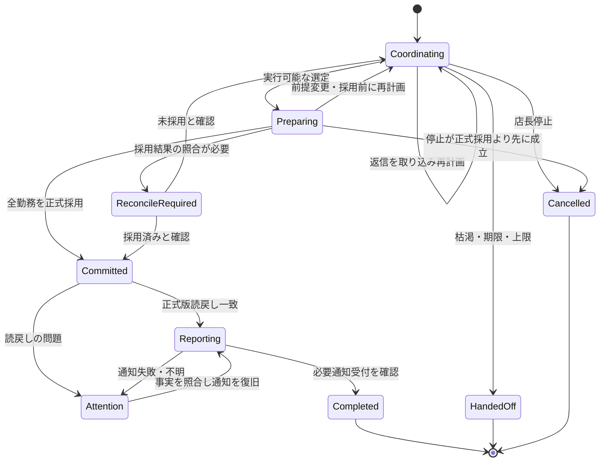

# RFC-011：同時個別打診・自然文承諾・案件状態の契約

作成：2026-09-20／更新：2026-09-21／状態：打診・承諾・状態分離は現行決定。Q07・Q09は確定済み

> 2026-09-21適用注記：Q07を「正式採用・読戻し・必要通知の受付まで」で確定しました（非選定通知・募集終了通知も対象）。Q09は、判定対象を元打診・現在の承諾・確定前後の状態を含む形で確定しました。§5の状態図には出口の無い経路が三つあり、[ADR-022](../adr/ADR-022-handoff-and-outcome-retention.md)で`ReconcileRequired → Attention`、`Attention → HandedOff`、`Preparing → HandedOff`を追加し、`HandedOff`の意味を「自動調整を終了し、人へ引き継いだ」へ変更しました。§5の表にある「未確定で引き継ぎ」は、この更新前の記載です。以下の本文は変更していません。
関連：[ADR-013](../adr/ADR-013-parallel-outreach.md)、[ADR-014](../adr/ADR-014-natural-consent.md)、[ADR-017](../adr/ADR-017-state-boundaries.md)

## 1. 自律性の範囲

店長の欠勤登録・開始委任後、許可された候補への打診、返信の解釈、再計画、正式採用、結果報告を進める。スタッフ本人の意思は必須で、モデルが同意を代作しない。

開始操作、開始後の店長介入、スタッフの返信を分けて記録する。デモで観測できるのは「店長役の追加操作なし」であり、実店舗の業務中断時間を削減した実績ではない。

## 2. 同時打診

適格な全員へ個別に打診し、グループチャットに公開しない。同時とは同じ募集で並行に開始することで、全宛先への同時到達を保証する意味ではない。

候補ごとに送信待ち、受付済み、返信待ち、追加確認中、回答済み、失効、終了を持つ。一人の確認失敗で案件全体を閉じず、残る候補・同意・期限で判定する。送信の一部失敗は相手ごとに記録する。

Outreachは初回打診・追加確認・返信・確定通知・非選定／募集終了通知を束ねる。条件と意味が違うメッセージを「重複送信」として一律に抑止せず、送信操作ごとのキーで二重送信を防ぐ。

## 3. 自然文承諾の成立

現行方針は、元打診と返信から勤務意思と条件が一意に決まり、検査を通過した返信をCommitmentにする方式。全件の専用確認ボタンを必須にしない。

打診には店舗・日付・職種・提示時間・最大追加勤務時間・期限と、「回答した条件で選定されれば確定する」「未選定なら勤務は決まらない」を示す。単なる勤務可能時間の調査と自動確定への同意を混同しない。

以下を検査する。

- 認証された回答者が打診対象のスタッフ本人である。
- 返信対象と提示条件を不変のMessage参照等から特定できる。
- 日時・職種・勤務意思が一意で、未解決の条件がない。
- 提示範囲・可能時間・勤務上限・期限を満たす。
- 採用するReplyInterpretationのID、抽出規則版、原文の根拠を記録する。

コードによるschema・時刻検査だけでは意味の読み落としを保証できない。対応文型を限定するか、条件が曖昧なら追加確認する。自己申告confidenceを同意の証拠にしない。対応文型の範囲はQ09。

## 4. 訂正・撤回・受信順

Commitmentの内容は訂正で上書きせず、新しいIDとsupersedes参照を作る。同一案件・スタッフで選定可能な版は一つ。

| 入力 | 確定前 | 確定後 |
|---|---|---|
| 明確な訂正 | 旧承諾を失効、新条件を検査 | 元の勤務を保持し変更申告を人へ返す |
| 明確な撤回 | 選定から除外 | 勤務を自動取消しせず人へ返す |
| 曖昧な変更 | 旧内容は保持するが選定を保留 | 要対応として確認する |
| 未処理の新しい返信 | 選定対象スタッフの確定を保留 | 確定事実を保持して処理する |
| 期限後・終了後の返信 | 記録・適切な回答のみ。確定へ使わない | 必要なら変更申告として扱う |

occurredAtとreceivedAtを分け、永続受信した案件内順序を持つ。最新はAI処理完了順で決めない。受信・正式採用が同じ排他規則を守り、受信済み変更を未処理のまま無視しない。古い実行結果は案件版・入力順序の不一致で適用しない。

## 5. 案件と対話の状態を分ける

v0.4の処理段階をそのまま案件の唯一の状態にすると、「Aは確認中、Bは承諾済み」を扱いにくい。[ADR-017](../adr/ADR-017-state-boundaries.md)に基づき、以下の状態分離を採用する。

| 対象 | 状態の責任 |
|---|---|
| AbsenceCase | 調整中・確定準備・確定済み・要対応・完了・未確定で引き継ぎ・停止 |
| Outreach | 相手ごとの送信・返信・確認・終了 |
| ScheduleUpdate | 出力生成・検査・正式採用・成否照合 |
| Messageの配送管理 | 送信ごとの待ち・受付・失敗・不明 |
| ProcessingEvent／worker | 一つのイベントを処理した段階と結果 |

状態を対象ごとに分離することは承認済み。この図の`Reporting --> Completed`だけは、Q07の初期推奨「必要な通知受付まで業務完了」を仮置きしている。確定と通知を別完了にする場合は、完了遷移、指標、画面を対応して変更する。

完了後の訂正は自動調整を再開せず、元のcompletedAt・確定内容を保持した追記の変更申告として扱う。CaseOutcome一つを上書きして過去の完了を消さない。別Handoffテーブルは必須ではない。

成否が照合できない場合はReconcileRequiredまたはAttentionとして人の対応を記録し、未確定と断定して終端へ落とさない。

## 6. 宛先・認証・メッセージ

ContactEndpointはstaff内の値でよいが、endpointKeyが指す宛先を不変にするか、Outreachに使用版を固定する。途中の宛先変更で旧打診を別人へ送らない。送信直前の現在の連絡許可は別途検査する。

イベントの重複キーはprovider・connectionId等の範囲を含める。受信本文で任意のstaffIdを名乗れても認証された本人とみなさない。MVPは架空スタッフのローカルな役切替であり、本番の本人認証とは区別する。

Message本文は不変だが配送状態は照会・更新される。Outreach.statusだけで初回・確認・確定通知の全配送結果を代表させない。将来のLINEでは本文なしのイベントや検証失敗があり、receiveEventが常にMessageを返すとは仮定しない。現段階では模擬返信契約だけを実装する。

## 7. エージェントと予算

AIは返信解釈と必要な次行動の提案を担い、候補・区間計算・権限・確定はコードで検査する。OrcaRouter利用と費用の実測／推定／不明の区別はRFC-004を継続する。

同時返信で複数の推論が起きるため、呼出し前の回数・費用予約を共有する。旧案の10call／案件は暫定値であり、全員打診・確認の件数を踏まえDay 1に再検証する。上限が少なくても無視して続行せず、残りを引き継ぐ。金額予算未設定なら有料呼出しを始めない。

全員への打診は通知数を増やす可能性がある。速度だけでなく、1案件の打診数・確認数・非選定数・終了通知数を記録する。確定した相手だけに通知して他の候補を待たせたままにしない。
